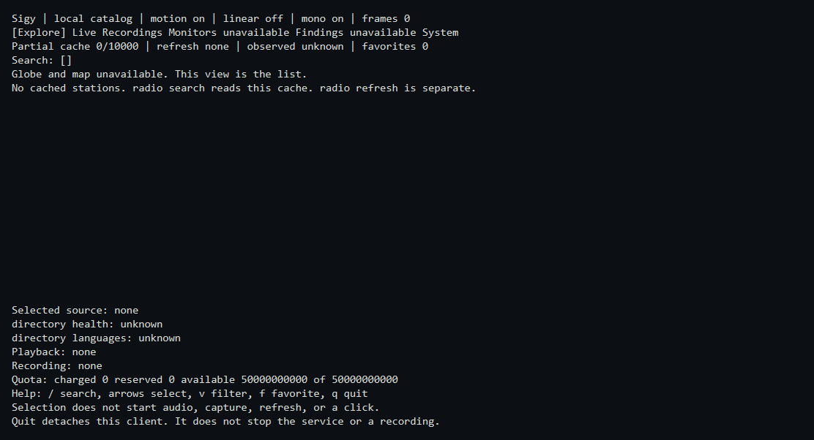
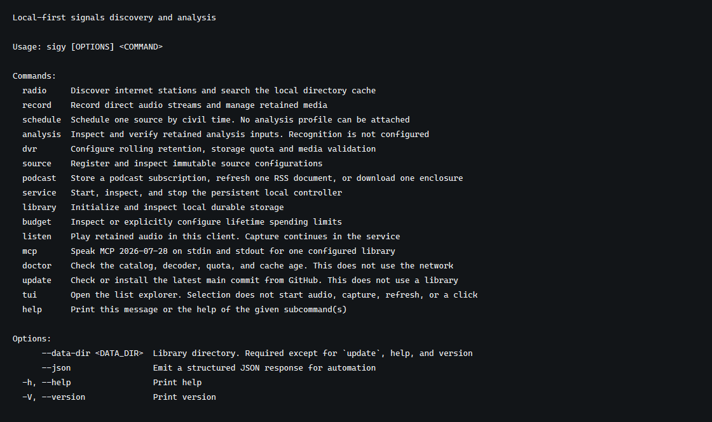

# Sigy

Sigy is a local-first application for finding signals, recording them, and keeping the evidence of what was received. The command line is the complete interface. The optional list explorer is another view of the same library. A background service continues admitted work after the client exits.

The first complete release is intended to cover world radio, organized recordings, live translation, and bounded topic monitoring. Most expected speech and music are non-English. English is the primary translation target. Local processing is the default, and paid processing stays off until a finite budget is set. This checkout is not a release.

## List explorer



This is one frame of `sigy tui` on Windows, drawn by the Termina backend at 120 columns by 30 rows against an empty local catalog. Reduced motion and monochrome are on, and the frame count stays at zero. The globe and map are unavailable. Selecting a row does not start audio, capture, refresh, or a directory click. Quitting the explorer does not stop the service.

## Command line



The picture is the output of `sigy --help` on Windows. The [usage guide](docs/usage.md) is the command reference for this checkout: library, service, radio, podcasts, recording, playback, and agents. Planning documents describe later behavior. They are not a second set of commands.

## Install

From a checkout of this repository:

```text
./scripts/install.sh
```

```text
powershell -NoProfile -ExecutionPolicy Bypass -File scripts\install.ps1
```

`scripts/install.sh` is for macOS and Linux. `scripts/install.ps1` is for Windows. If `cargo` is missing, the script installs Rust 1.98.1 for the current user from the official rustup installer, then builds `sigy` from this checkout and puts that binary on the Cargo path. It does not install an operating-system service, download FFmpeg, or contact a station. Recording and playback need a trusted FFmpeg that you install separately and pass to `dvr configure`.

```text
sigy --data-dir PATH_TO_LIBRARY library init
sigy --data-dir PATH_TO_LIBRARY tui
```

`PATH_TO_LIBRARY` is a private directory outside the checkout. Initialization creates a catalog with paid processing disabled.

## What this checkout does

A radio recording of at least 32 MiB seals a segment at 32 MiB or after 5000 ms of receive time and keeps the job running. That 5000 ms bound is the candidate uncommitted window, not a measured durability result. The whole byte budget stays one reservation. `listen file` still plays one file and does not walk a multi-segment timeline. A disconnect, recovery, codec change, refused renewal, capture pause, or backward clock leaves a gap with that cause. Seeking inside the gap fails, and no silence file fills it. `sigy doctor` checks the catalog, decoder, quota, and cache age without using the network. A stale station cache stays searchable, favorites stay, and the report names the refresh command to run. The tested path on Windows includes a radio directory cache, favorites, and an explicit click; finite recording and retention; retained-file playback; playlist resolution; one direct listen; one finite HLS recording; and podcast subscribe, RSS refresh, one enclosure download, one publisher transcript or chapter fetch, and playback of that retained file. `sigy mcp` exposes those commands to an agent for the library given at startup.

Windows x86_64 is the host those checks ran on. Linux and macOS are not a support matrix. Follow the [roadmap](ROADMAP.md#build-order) and the [progress record](docs/development/progress.md). Start from [intent](INTENT.md) when the question is what Sigy is for.

## Lawful use

Sigy is for listening, recording, and analysis of sources you are authorized to receive. The [usage guide](docs/usage.md#lawful-use) states that boundary. It is not legal advice.

## License

Copyright 2026 Nick Seal.

Sigy is licensed under the [Apache License, Version 2.0](LICENSE). Third-party components remain under their own licenses and notices.
