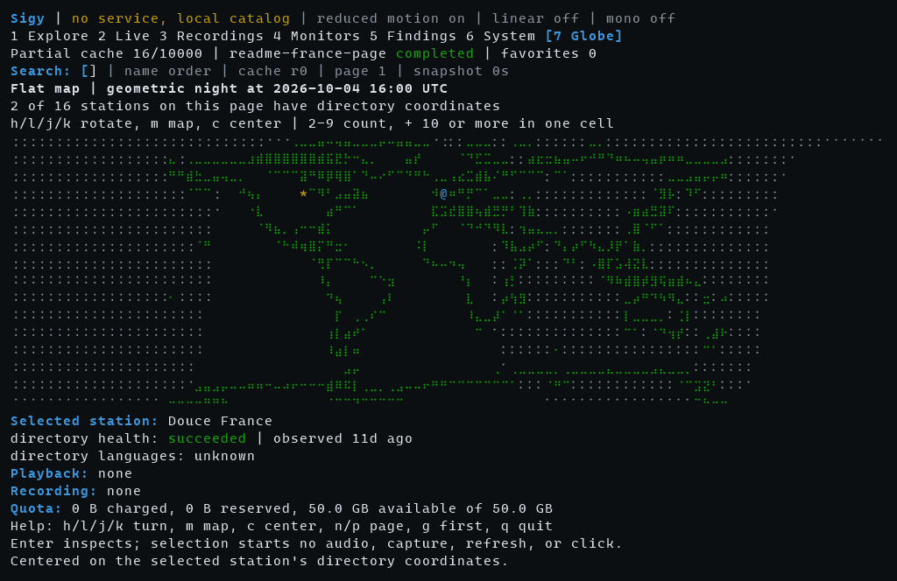

# Sigy

**Practical signals intelligence for everyday people.** Sigy is a local-first listening and analysis toolkit. Explore internet radio and podcasts, keep recordings, read across languages and trace findings back to their sources. Its CLI and terminal explorer share a background service that keeps working when you close the terminal.

**Windows development preview.** Local speech recognition and English translation run on retained audio, but language quality and platform support are not qualified. See [current capabilities and limits](docs/development/progress.md) and [what comes next](ROADMAP.md#whats-next).



The explorer rendered on 2026-10-02 with one real cached station page. Map positions come from directory metadata; selecting a station does not start playback or recording. [Explore the current controls](docs/usage.md#list-explorer).

## Install

Windows PowerShell:

```powershell
irm https://raw.githubusercontent.com/blisspixel/sigy/main/scripts/install.ps1 -ErrorAction Stop | iex
```

macOS or Linux:

```sh
sh -c 's=$(curl --proto =https --tlsv1.2 -fsS https://raw.githubusercontent.com/blisspixel/sigy/main/scripts/install.sh) && sh -c "$s"'
```

These commands build `main` from source; [installation details](docs/install.md) cover Git, the pinned Rust toolchain, FFmpeg and platform limits.

## What you can do

- **Explore world radio.** Search by station name, country name/code, language or tag. Press `C` for an offline country picker or `F` to combine filters, save favorites and browse a globe or map. Listen explicitly through the CLI. The country reference has 257 entries and names in eight locales; cached station coverage varies.
- **Keep a useful record.** Capture streams in the background, schedule recordings across time zones, and retain selected intervals. Recording timelines distinguish audio, gaps and expired material.
- **Read across languages.** Run experimental local recognition and English translation on retained audio, search originals and translations, and correct a transcript without erasing its history.
- **Follow a topic with evidence.** Bound a monitor's sources and resources, inspect literal matches, and save cited findings and briefings. Finite tasks can collect, process, freeze their exact evidence and publish cited findings with coverage-aware partial results. [Explicit interest withdrawal](docs/decisions/0079-task-interest-withdrawal.md) preserves shared processing. A general task planner remains ahead. Selected operations are available through the [agent plugin](docs/decisions/0021-agent-plugin.md).

## Get started

Create your local library, start the background service and load a first station page:

```text
sigy init --radio
sigy tui
```

Sigy uses `~/.sigy/library` by default. Use `sigy init` for setup without a directory fetch, or `sigy init --no-start` to prepare storage without starting a service. See [first use](docs/install.md#first-use) for custom libraries and recording setup, and the [usage guide](docs/usage.md) for full commands.

Your library and local processing stay on your machine by default. Paid model dispatch is not implemented. The [progress record](docs/development/progress.md#tracked-intermittent-test-issues) keeps known faults and verification gaps visible.

## Where it's going

A full-screen, retro-futuristic world listening desk: type or select countries and major cities, combine filters, explore linked maps and station lists, and use a radio DVR to revisit retained passages while other sources keep recording. Original scripts, chosen qualified translations and cited findings connect discovery to understanding. English remains the default; other targets are planned for humans and agents. The same service contracts should grow from personal machines to larger deployments as capacity and recovery are measured. These are planned capabilities; see the [roadmap](ROADMAP.md#whats-next) for delivery checkpoints and the [engineering plan](docs/development/reliability-and-scale.md) for their acceptance criteria.

The [storage and knowledge plan](docs/design/storage-and-memory.md) adds a measured path for small servers, larger media libraries and future NAS placement, with searchable evidence, time-aware topic context and portable wiki-style exports. Current storage remains one local library; these deployment and memory extensions are planned.

Later, a [Strange Signals Desk](docs/design/strange-signals.md) brings cited claim comparisons, public-archive experiments and a playful, rigorous SETI watch. Observations, competing explanations and unknowns stay inspectable.

## Learn more

- [Installation and updates](docs/install.md) and [command reference](docs/usage.md)
- [Current progress and verification evidence](docs/development/progress.md)
- [Product intent](INTENT.md) and [what comes next](ROADMAP.md#whats-next)
- [Near-term build briefs](docs/development/near-term-implementation.md) and [workflow invariants](docs/design/workflow-invariants.md)
- [Architecture, design and research](docs/README.md)

## Use responsibly

Laws about receiving, recording, decoding, storing and sharing signals and broadcasts vary by country and region, and they can differ for internet streams, radio frequencies, encrypted traffic and personal data. You are solely responsible for knowing and following every law, regulation, license condition and terms of service that applies to you, your equipment, your location and your use. Only access sources you are permitted to access, keep hardware receive-only unless you hold the required authorization, and respect privacy and copyright. That a signal can be received does not mean you may record, decode, publish or reuse it. The [usage guide](docs/usage.md#lawful-use) has more detail.

Transcriptions, translations and findings are machine output and can be wrong. Check anything important against the original.

Sigy is provided "as is", without warranty of any kind. The authors and contributors are not liable for any claim, damage or other liability arising from its use or misuse, as set out in the license. Nothing in this project is legal advice.

## License

Copyright 2026 Nick Seal. Sigy is licensed under the [Apache License, Version 2.0](LICENSE), including its warranty disclaimer and limitation of liability. Third-party software and content retain their own licenses and notices. See [contributing](CONTRIBUTING.md) and [security reporting](SECURITY.md).
