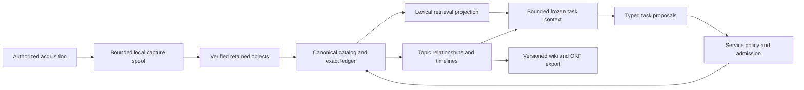

# Storage and knowledge memory

Updated: 2026-10-03. Status: proposed architecture and implementation contract. The user's small-server, desktop, NAS and larger-deployment goals are confirmed; specific capacity and deployment profiles remain unqualified. Current media, catalog and scratch are colocated within one owned library. Archive passage search and immutable transcript, finding, briefing and task slices exist; external media stores, indexed archive retrieval, temporal claim extraction and knowledge-format adapters do not. [Active work](../development/progress.md) owns implementation evidence.

This contract extends [architecture and data](../planning/02-architecture-and-data.md), [analysis and knowledge](../planning/10-analysis-and-knowledge.md) and [scaling architecture](scaling-architecture.md). The [engineering packages](../development/reliability-and-scale.md#storage-and-memory-increments) own sequencing and acceptance. Primary evidence, alternatives and limitations belong in [storage research](../../research/36-storage-placement-and-capacity.md) and [memory research](../../research/37-knowledge-formats-and-temporal-memory.md).

## One authority, several useful representations

Separate transactional authority, bulk objects and retrieval views so each can grow without changing what a result means. Logical memory roles do not require separate databases or services. Begin with the existing catalog and supervised service; add a physical backend when a declared workload demonstrates the need.

This describes planned responsibilities. Derived content returns through ordinary validation and admission if it proposes new work. A generated answer, summary, translated copy or imported page cannot become an independent source, a permission, or a budget change.

| Logical memory role | Durable content and lifecycle | Authority |
| --- | --- | --- |
| Evidence | Source revisions, retained object identity and clocks, observations, transcript/translation revisions, language evidence and receipts | Canonical records preserve exact history and declared retention; checksums establish byte identity, not semantic truth |
| Task and episode history | Accepted task scope, bounded progress, effect/usage receipts and frozen outcome membership | Existing service transactions own effects, replay and exact charges; model conversation is not the job journal |
| Claims and entities | Attributed propositions, candidate entity identities, support/contradiction links, derivation revisions and unresolved dependence | Interpretation remains qualified, revisable and attributed; a relationship does not prove its proposition |
| Navigation | Lexical indexes, optional embeddings, adjacency lists, topic pages and timelines | Rebuildable projections identify their inputs, generation and incomplete coverage |
| Working context | One finite selection of exact revisions, passages, relationships, coverage and limitations | A frozen input envelope for one task attempt; retrieval cannot expand task scope |
| User preferences and procedures | Explicitly supplied context and separately accepted versioned methods or skills | Their declared scope applies; imported evidence and wiki pages cannot install methods or edit policy |

Store only task context needed for reproducibility and recovery, under a declared retention policy. Do not accumulate every prompt, intermediate text or duplicate recording as permanent memory. Summaries keep their exact dependencies; loss or correction of supporting records remains visible.

## Placement and ownership

The service's canonical catalog, WAL, shared-memory file and ownership lock remain on a qualified local filesystem. A network share containing all of `--data-dir` is not a supported NAS arrangement. A NAS can eventually hold explicitly configured bulk media, or run Sigy against storage local to its own service host. Backups have a separately declared destination and failure domain. Current setup does not implement independent media placement.

| Storage class | Proposed placement | Independent bounds |
| --- | --- | --- |
| Catalog, ledger and ownership | Local service volume with measured flush, locking and recovery behavior | Catalog/WAL growth, transaction/scan work and checkpoint pressure |
| Capture spool and worker scratch | Qualified local storage accessible to the supervisor | Worst-case admitted bytes, free-space floor, leases, orphan cleanup and I/O execution slots |
| Retained media | Initial local store; later second local volume, then qualified NAS or object backend | Store identity, physical headroom, retention quota, transfer backlog and reachable-state evidence |
| Retrieval and topic projections | Initially local, independently rebuildable | Index bytes, generation rebuild space, batches, reader lifetime and refresh lag |
| Frozen reports and wiki bundles | Explicit bounded export destination | File/byte counts, sensitive fields, exact membership, staging and publication |
| Backup | Explicit independent destination with a catalog snapshot and media manifest | Snapshot/read leases, streaming manifest bounds, verification and clean restore |

Capacity settings express policy. They do not prove actual free space, media endurance or supported throughput. Preserve the existing 50 GB and 14-day defaults until explicitly changed; a stated 2 TB or 20 TB device never silently enlarges capture authority or consumes all available storage. Display byte units consistently and distinguish configured limits, charged bytes, reserved bytes and measured available space. Filesystem compression or deduplication cannot silently refund logical liabilities.

The initial placement inventory should report the already owned library and current derived paths, detected OS/architecture and existing accounting. It must label unmeasured locality, capacity or durability instead of guessing from a path or hostname. It performs no media walk, network request, inference or candidate-store probe. Paths are bounded and sanitized; ordinary diagnostics exclude unnecessary absolute paths. Missing media directories in a fresh library are normal.

## Media identity and cross-store publication

Add store identity only with a concrete second-store package. A store record needs a stable opaque ID, configuration revision, owned marker, platform filesystem/mount identity where observable, permitted operations and a qualified capability profile. Each object reference binds that store and generation to a relative safe key, size, checksum and lifecycle state. Catalog identity and object identity remain separate from physical location.

All media consumers use the same typed resolver: capture sealing, playback, analysis staging, verification, retention, backup, restore and recovery. Recheck store identity before read, write and delete and at publication/recovery boundaries. Do not recreate a missing mount path, fall back to the underlying local directory, follow unaccepted links, or reinitialize a missing owned marker. A pathname alone does not establish store continuity.

Distinguish unavailable store, missing object on the verified store, corrupt bytes, permission failure and wrong store. Current retention accepts `NotFound` within its owned local-media contract. Extending that rule to a disappearing NAS could falsely mark media released. A new backend must prove the expected store is still present before interpreting absence or committing a release. Uncertain deletion holds the operation and its accounting.

Cross-store transfer is a recoverable protocol:

1. Admit finite destination bytes, local spool/scratch and transfer work before copying.
2. Copy to a unique staged object at the verified destination; never assume cross-filesystem rename is atomic.
3. Verify complete length and checksum, obtain the destination profile's required durability acknowledgment and publish there.
4. Commit the new location and transfer receipt with its exact generation in the catalog.
5. Delete the old copy only after the new location is committed and all relevant readers are proven finished; record cleanup separately.

Track temporary double occupancy and copies conservatively through crashes. A content hash cannot act as a global deduplication permission across incompatible owners, retention policies or private scopes. Storage outages hold transfer or analysis while separately admitted local capture continues within its finite spool. A full spool records a policy outcome and capture gaps; it never grows indefinitely or opens a new destination.

The first second-local-volume move is offline under exclusive library ownership. Freeze one finite object manifest, source/destination store generations and move parameters before copying; resumed passes keep exactly that membership. A location change preserves immutable recording, transcript and citation IDs and byte digests. Specify this concrete state machine before building its typed resolver. Do not add a generic storage framework to anticipate every later backend.

Do not run blocking NAS I/O inside the catalog actor or transaction. Bound execution slots, queues, transfer bytes and retry work. An application deadline or lost lease does not prove a blocked filesystem call stopped. Preserve relevant read leases and capacity until actual completion or a separately qualified termination/reconciliation mechanism supplies evidence.

## Archive retrieval at sustained scale

Current `analysis search` scans bounded revision/cue rows with the monitor's literal comparison. Its application deadline is checked between reads; it is not a hard bound on SQL virtual-machine work or blocked filesystem I/O. Improve measured query plans and selective metadata access before adding a new database. Scoped SQL progress cancellation can bound cooperative database work; it cannot force a kernel read to return.

A lexical projection records exact cue/transcript/translation revisions, translation target, normalization/tokenizer version and projection generation. Candidate results are revalidated against canonical revision currency, access scope and media state. Preserve a literal-search path and publish distinct indexed semantics when tokenization differs. Parameter binding alone does not make full-text query grammar literal.

Keep originals and meaningful distinctions across scripts. Evaluate Unicode normalization, case, combining marks, RTL, segmentation, short queries, regional aliases, Navajo diacritics and Klingon case before choosing a tokenizer or default matching policy. English stemming is not a universal language policy. Retrieval ranking is relevance within a method and sample, never confidence or truth.

Commit canonical publication and its projection-pending marker together. Reuse bounded service passes to build idempotent documents, retain an applied watermark and expose lag, missing coverage and failed batches. Rebuild into a new generation, verify it and switch the read pointer; crash/restart must resume or abandon staging without losing the last useful generation. Freeze cursor identity against query, order and generation. Bound batches, readers and old-generation retention so rebuilding cannot starve capture or fill storage.

Bind a rebuild to a committed canonical cutoff and explicitly process or report subsequent corrections/deletions before switching generations. Readers still revalidate candidates against current canonical state. A complete index at an earlier cutoff is not a claim that current evidence is fully indexed. Erased content cannot remain serveable while a generation catches up.

Optional semantic retrieval follows a useful lexical baseline. Pin runtime/model hash, language/task capability, target, exact input revisions, chunking and normalization. Bound model loads, candidate count, graph traversal, reranking and context bytes. Measure recall, severe misses, abstention, latency tails and resource use against independent multilingual references. Filtered approximate search can lose relevant neighbors; deterministic scope filters and explicit truncation remain mandatory. Adopting embeddings does not qualify entity resolution or claim extraction.

## Temporal claims and topic context

Keep different time meanings explicit:

| Time | Meaning and limits |
| --- | --- |
| Capture/media time | Received interval and its clock/sample mapping; not necessarily original broadcast or event time |
| Asserted/reference time | The time a source says something happened; preserve exact wording, ambiguity, zone and precision |
| Catalog time | When Sigy admitted or published a record, including late arrival |
| Derivation time | When a particular method produced this interpretation |
| Proposed validity interval | An attributed interpretation of when a relationship applies; unknown or open bounds stay explicit |

Support both event-oriented queries and knowledge-as-of queries without overwriting history. An exact catalog snapshot says which records were available then; it does not prove what happened then. Clock regression, vague dates and uncertain source timestamps need their existing domain-specific handling. Do not derive event time or relationship validity from ingestion time.

Define knowledge cutoffs using a committed revision/generation boundary or a named stored snapshot. Wall-clock timestamps alone cannot order equal-time commits, clock regression or late-arriving records. This general cutoff/reconstruction mechanism is proposed; current frozen checkpoints and briefings retain their narrower stored membership and coverage semantics.

A correction supersedes one derived revision. A contradictory statement from another source preserves competing reports rather than automatically invalidating an earlier claim. Retraction, quotation, negation, hypothetical statement, rebroadcast and unresolved independence need distinct relationships. Entity links preserve original names/scripts, candidate aliases and merge/split history; matching a name is insufficient identity evidence.

Start a topic graph from exact existing findings and revision dependencies. That read-only adjacency/timeline package needs no model inference or graph database. Semantic extraction is a later qualified transform. Store typed relationships in the existing catalog where it meets the workload; a specialized backend needs measured traversal/storage need, conformance, migration and restore evidence.

Initial edges express exact membership, derivation dependencies and established mechanical repetition only. Semantic support, contradiction and entity equivalence require separately qualified or explicitly supplied provenance and remain unresolved otherwise. Navigation over two related revisions is not an inference about the world's entities.

Every task context binds its retrieval request, source scope, exact selected IDs/revisions, requested targets, ordered passages, derivation/profile identities and projection watermark. Include gaps, missing or stale support, unresolved relationships and limits reached. Bound traversal depth, fan-out, visited records, context bytes and wall time separately. Context refresh is a new version, not a silent mutation of an admitted attempt. A summary must not hide that retrieval was incomplete.

## Wiki and knowledge-format interchange

Use Markdown pages for inspectable accumulated topic context, navigation and portable exports. Export a named projection generation with stable opaque paths, localized titles, preserved original scripts, exact source IDs, revision dependencies and coverage. Group passages into bounded pages; do not create a file per cue or require a Git commit for every observation. Index/log pages support navigation and export history, while the catalog remains the authoritative journal.

The linked Google article describes an early Open Knowledge Format v0.1. Its old directory now directs readers to a separate canonical repository with v0.2. The [dated format review](../../research/37-knowledge-formats-and-temporal-memory.md) records the exact reviewed revision. Treat OKF as a candidate export adapter over Sigy's canonical evidence; it is not a replacement database, an inference framework or a semantic-quality certificate. Export implementation rechecks and pins the schema revision before selection.

Preserve Sigy-specific provenance and temporal distinctions in namespaced extensions or companion structured manifests. Imported popularity signals and `verified` assertions remain supplied metadata; they cannot establish source independence, accuracy, human review or permission. Omit optional attribution fields that cannot be truthfully and permissibly populated. Internal transform identity remains exact technical provenance, separate from public authorship.

Begin with export and an independent bounded bundle validator. Round-trip or import follows its own decision: bounded UTF-8/YAML/Markdown, maximum files/depth/bytes, safe paths and links, preserved unknown fields and explicit conflicts. Never automatically fetch URLs, execute computation or attestation blocks, install a skill, load instruction files into privileged context, or modify budgets from a bundle. Deterministic structural/byte checks prove only their named properties. Exporting valid syntax cannot establish that a claim is true.

## Retention, correction and restoration

Model the retention categories independently: raw media, original and translated text, task/claim history, projections, scratch, diagnostics and exports. Media expiry preserves historical evidence identity with unavailable replay. A future privacy-erasure operation has separately authorized scope and dependency handling; it is not equivalent to media pruning or adding a correction. Rebuilds must respect canonical deletion/tombstone policy and never restore erased payload from a stale cache.

Mark dependencies stale by exact revision and retain old report snapshots under their declared retention. Recompute only under existing finite authority. A missing source cannot be replaced with generated text; an old wiki page cannot restore expired media. Include projections, exported bundles and backup copies in the documented erasure limitations and obligations.

Backup captures a consistent catalog snapshot, exact media identities/store maps and a bounded manifest. At large object counts, use a versioned streaming or paged manifest instead of removing today's allocation limits. Object-store ETags are not a universal checksum. A NAS snapshot alone establishes neither application consistency nor an independent backup failure domain.

Restore first into private staging on a clean declared host. Verify catalog/media correspondence, migrate deliberately, reconcile leases and interrupted work, and only then make the library available. Indexes and topic pages rebuild from retained canonical records; restoration cannot refill grants, spending limits or capture authority. A remote backup destination does not grant remote execution permission.

## Deployment qualification and growth

Pi-class machines are meaningful capture/catalog/search targets, with CPU-only processing evaluated separately. Device capacity, flash endurance, actual usable space, power stability and thermal behavior require exact hardware evidence; an unnamed 2 TB card is not qualified by its advertised size. Graphics capability does not establish a supported speech accelerator. Gaming machines qualify CPU and each optional GPU/driver/profile combination independently.

Reproducible infrastructure starts with one service owner, pinned application/native assets, explicit local authority volume, bounded scratch, configured bulk store, service identity, secret references and destination policy. Reapplying configuration preserves accepted scope, journal, grants and exact liabilities. Verify shutdown/drain, restart, remount, disk pressure and backup/restore under the chosen manager. Containers or infrastructure-as-code do not replace native containment or filesystem qualification.

Move to additional execution hosts when measured processing demand justifies scoped transfer and fenced remote attempts. Move canonical authority to a second transactional backend only when writer/commit/storage workloads require it and shared conformance passes. Partition capture only after exclusive ownership, failover, gaps, accounting and cross-partition query semantics are specified and proven. Preserve the useful single-host installation through every step.

Before a workload run, freeze host/storage identities, OS/filesystem/protocol/mount options, models/targets, library size, query set, ingest rate, retention, policy and fault schedule. Measure capture gaps, control/query latency tails, SQL work, WAL/checkpoint growth, index lag/rebuild footprint, CPU/thermal behavior, transfer backlog, actual available space and clean restore. Report observed capacity and limitations for that profile. No Pi, NAS, multilingual-memory or distributed-support claim follows from this design alone.
