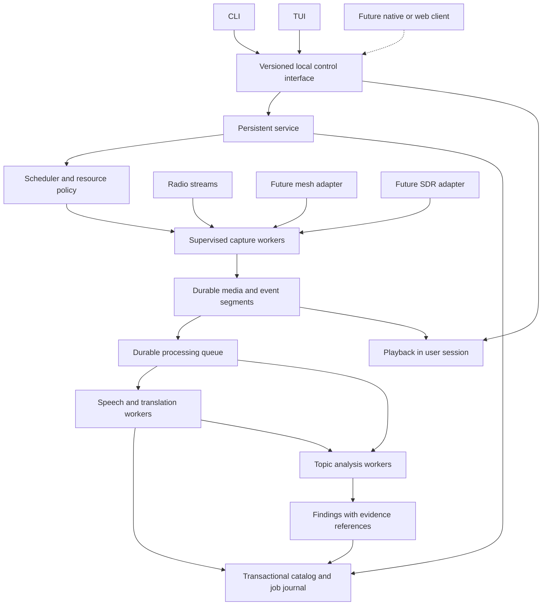
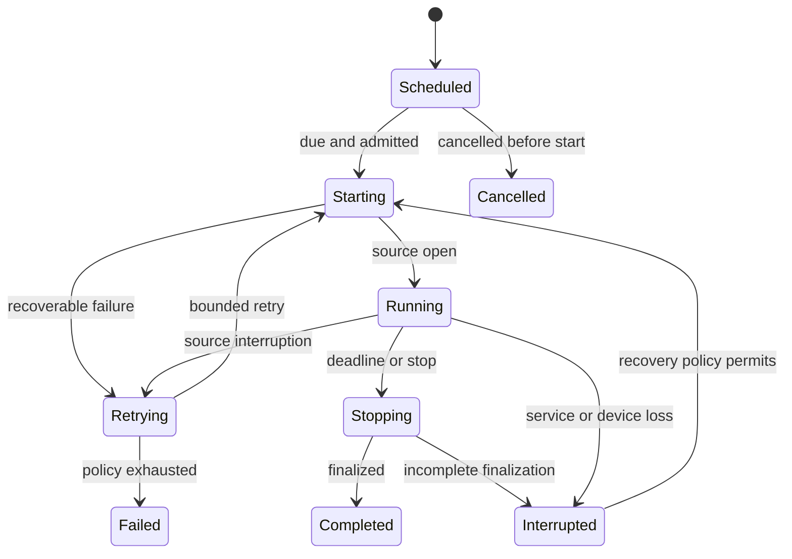

# Architecture and data

Status: broader system design with incremental implementation. The [foundation](../decisions/0001-rust-foundation.md), [local controller](../decisions/0002-local-controller.md), and [capture journal](../decisions/0003-capture-journal.md) decisions record selected and locally tested subsets. Remaining workers, media storage, provider paths and platform profiles retain their evidence gates.

## 1. Design principles

1. Durable capture takes priority over analysis and display.
2. The service owns accepted jobs; terminal clients own their interactive sessions.
3. Source material and derived interpretations have separate identities and lifecycles.
4. Every queue, retry loop, buffer, and resource reservation has a bound.
5. Recovery and cancellation are normal workflows with specified outcomes.
6. Adapters advertise capabilities and limitations rather than pretending all sources are interchangeable.
7. Evidence provenance survives model upgrades, exports, and reprocessing.
8. A future interface uses the same application operations and event model.
9. Audio, samples, packets, text, telemetry, and timed symbols retain their own types and timing semantics.
10. Language is observed within content intervals; source metadata never fixes the language of an entire stream.

## 2. Proposed system boundaries



This is a logical decomposition, not a requirement for a distributed system or a separate executable for every box. The leading architectural proposal is one local service with isolated media and inference workers, using explicit internal boundaries. Process count and sharing require measurements.

### Responsibility allocation

| Boundary | Responsibilities | Must not depend on |
| --- | --- | --- |
| CLI/TUI | Input, navigation, rendering, local playback requests, event subscriptions | Owning durable capture tasks |
| Service | Configuration, job acceptance, scheduling, policy, catalog, worker supervision | A particular terminal or model being available |
| Capture adapter | Connection, stream framing, timestamps, segmentation, health | Model inference, UI refresh, report generation |
| Processing worker | ASR, translation, extraction, indexing for assigned work | Unbounded in-memory history or direct control of sources |
| Monitor planner | Interpret goals, propose source changes and bounded work | Unrestricted process execution, credentials, or control commands |
| Policy executor | Validate plans, reserve resources, perform allowed operations | Treating model output as authorization |
| Playback session | Output-device selection, volume, seek and buffer behavior | The service running inside an interactive desktop session |

## 3. Service lifecycle and local control

The confirmed requirement is survival of client closure. Supporting collection before login, after logout, and after reboot needs an explicit installation profile. These modes have different OS integration requirements; they must not be conflated.

| Mode | Intended use | Design consequence |
| --- | --- | --- |
| Foreground service | Development, diagnostics, a manually managed host | Same service core, supervised by the caller |
| Per-user background service | Personal desktop operation | User-scoped state and credentials; logout behavior documented |
| Always-on service | Dedicated host and unattended collection | OS service manager, explicit service account, durable storage access |

Linux service integration, macOS launch agents/daemons, and Windows Service Control Manager integration need platform-specific adapters. User playback remains outside the unattended service. See the [platform evidence](03-source-and-model-research.md#platforms-and-terminal-behavior).

The local control contract needs authenticated identity or OS-enforced peer access, explicit version compatibility, structured errors, idempotency keys, event cursors, and cancellation semantics. The initial controller selects protected local sockets/named pipes with strict version checks, bounded messages and shared catalog operations. Event subscriptions and operation-specific cancellation remain future extensions. See the [controller decision](../decisions/0002-local-controller.md) for implemented controls and platform limitations.

Remote access is a separate capability requiring explicit configuration. A future web client does not justify binding the first release to every network interface.

On client reconnect, retrieve a state snapshot and resume events from a cursor. If the requested history has expired, signal the gap and provide a fresh snapshot. Slow subscribers cannot block capture or grow an unbounded event buffer.

The service prevents a second writer from opening the same library. Client cancellation cancels the request or subscription; it only cancels the durable job when the operation explicitly says so.

## 4. Capture and media flow

### Shared capture

Represent an upstream acquisition separately from the jobs that consume it. Two jobs may share acquisition only when their source, authentication context, tuning, fidelity, and timing requirements are compatible. Consumers have references to the acquisition. Detaching one consumer does not close the source while others still need it.

Sharing should avoid duplicate upstream traffic and duplicate radio tuning. It must also preserve separate retention, schedules, and analysis policies. Backpressure in one consumer cannot stall every other consumer.

DVR playback sessions have independent playheads over shared retained segments. Rolling-buffer references, durable recordings, and evidence pins have separate ownership and expiry rules. Saving a buffered interval reserves storage and protects its segments atomically against retention. A listener pausing or detaching does not stop an independently owned recording. [Explorer and DVR contract](11-radio-explorer-and-dvr.md).

### Recording formats

Preserve original compressed audio where a reliable remux and segmentation path exists. Produce decoded PCM for analysis as a derivative. Where the source cannot be preserved in that form, store a documented normalized representation and transformation metadata.

Candidate archive choices include compressed source segments and lossless audio. The codec/container choice must account for seeking, crash recovery, timestamp continuity, metadata, license compatibility, and storage cost. No format is selected solely for decoder convenience.

Distinguish downloaded HLS/playlist metadata from playable archival content. A list of URLs that later expire is not a retained recording. Preserve required initialization data when the chosen container needs it.

### Proposed commit protocol

1. Reserve budget and create a durable capture record before declaring the job accepted.
2. Write each new segment to a unique temporary object.
3. Finalize the media framing, record checksums and sample/time bounds, and perform required durable writes.
4. Publish the object atomically where supported, with platform-appropriate flush semantics.
5. Commit the segment reference and processing work item in a catalog transaction.
6. Emit the committed-segment event only after the catalog commit succeeds.

Filesystem objects and catalog entries do not share a universal transaction. Recovery must explicitly reconcile finalized orphan objects, catalog references to missing media, incomplete temporary files, and interrupted transactions. Durable-write behavior must be verified on supported local filesystems. Network and removable storage need separate support policies.

Never label a segment complete merely because a subprocess exited. Validate its media structure and measurable duration. Preserve useful partial results with an interrupted state.

### Time model

Keep receive time in UTC, monotonic acquisition duration, source media timestamps where present, sample positions, and any reliable source clock information. Preserve clock discontinuities and reconnect gaps.

Receive time is not necessarily original broadcast time. HLS buffering, provider latency, and local queues introduce delay. Any displayed broadcast-time estimate must name its basis. Source gaps do not become fabricated silence unless a derived export explicitly inserts it and records the transformation.

Use IANA time zones for schedules and display, with defined daylight-saving behavior. Store occurrences with explicit time bounds. A missed occurrence after sleep or downtime is recorded; it cannot capture an already elapsed live broadcast.

## 5. Durable jobs and resource control

Capture states and processing states are independent. A capture can be healthy while translation is delayed.



Each transition includes cause, attempt, timestamp, and correlation ID. A user-requested pause in live capture creates a known gap. Processing may be paused without stopping capture if storage policy permits.

Processing uses durable at-least-once attempts with idempotent result publication. Each logical operation includes input identity and revision, operation type, model identity, parameters, and pipeline version. Stale attempts cannot overwrite newer revisions. A retry after a provider timeout may incur duplicate external work; exactly-once external execution is not claimed.

Worker leases require fencing or equivalent generation checks so an expired worker cannot commit after replacement. On startup, reconcile worker ownership and persisted job state. Terminate only verified owned processes, not arbitrary matching executable names or reused process IDs.

### Admission and overload

Limits include simultaneous sources, network rate, retained bytes, free-space reserve, CPU work, model concurrency, GPU memory where discoverable, analysis backlog, and remote spend. Reservations happen before work starts, with runtime enforcement and estimation error handling.

Proposed overload sequence:

1. Reduce nonessential UI update frequency and background indexing.
2. Queue batch analysis and reports behind live processing.
3. Mark live processing as delayed when its target is missed; keep capturing.
4. Reject new work beyond the configured budget.
5. Apply the saved retention policy only to eligible data.
6. Before exhausting the reserve, stop affected captures with a recorded reason and preserve finalized segments.

Model switching, reduced capture fidelity, remote fallback, or sampling instead of continuous recording must follow an explicit user policy. Resource pressure cannot silently change what the job promised to collect.

Resource budgets must include worker processes and native libraries, not just the service's heap. A logical queue limit alone does not limit a GPU runtime or a decoder subprocess.

## 6. Live and later language processing

Proposed pipeline:

```text
audio -> decode/resample -> speech activity -> language detection/override
      -> provisional ASR -> final ASR revision -> translation -> topic analysis
      -> retained original audio and gap timeline
```

Speech recognition, translation, embeddings, summarization, and planning are separate provider capabilities. A provider can implement several capabilities without collapsing their contracts.

Semantic classification is another optional capability, accepting text or supported structured metadata. Its typed results can prioritize analysis; counts, date comparisons, rates, and rankings remain deterministic operations. Dedicated decision endpoints and local classifiers need their own capability contracts. See [Analysis and knowledge](10-analysis-and-knowledge.md).

English is the primary translation target. Most expected speech is non-English, so language identification, code switching, original-script preservation, and unsupported-language behavior are core requirements.

### Language blocks and spans

An analysis block references source/channel configuration, acquisition, original media or event bounds, content classification, and processing revision. It may cross storage-segment boundaries. A block contains zero or more observed language spans rather than one mandatory language. Each span records candidate tags, offsets, detection granularity, method/model, uncertainty, and scoped user overrides.

Station metadata remains a separately attributed hint. Never fabricate span precision from a detector that supplies only a block-level result. Mixed speech, insufficient speech, instrumental music, detector failure, and unsupported language are distinct states. A new language decision may produce a new transcript and dependent translation revision.

Use the same language contract for packet text and decoded messages when applicable. Numeric telemetry and symbolic Morse groups need no forced natural-language classification. See [Multilingual research](../../research/10-multilingual-processing.md) for routing alternatives and corpus requirements.

### Streaming semantics

- Segment audio with context overlap or use a true streaming recognizer; benchmark both.
- Assign stable utterance IDs. Partial hypotheses revise an utterance, rather than appending duplicate sentences.
- Finalize at explicit boundaries. Reconcile overlap with word/sample timing where available.
- Preserve revisions, language decisions, code switching, and omitted/uncertain intervals.
- Translation references a specific transcript revision; later corrections can invalidate dependent results.
- Display current delay and backlog age. Separate caption availability from finalized translation latency.
- Suppress speech output for confidently non-speech intervals, while retaining the underlying media.
- Do not interpret a model's numeric score as a calibrated probability without evaluation.

Long sessions are processed incrementally. Context windows carry bounded relevant context, speaker labels where available, and terminology preferences. Do not stuff an entire day's transcript into one prompt and silently truncate it.

Batch processing uses the same evidence identities, can use a different quality profile, and produces new revisions. Model asset IDs, hashes where available, runtime versions, prompts, and decoding parameters are recorded for reproducibility. Reproducibility means traceable configuration; identical bytes from every inference backend are not assumed.

Live and batch queues track audio duration, work estimates, retained bytes, oldest age, and input-retention dependencies. Reserve bounded capacity for older work so live traffic cannot starve it indefinitely. Report unsustainable arrival rates explicitly; capture capacity is not a promise of equal live translation capacity. Local profiles must remain useful with paid processing disabled. [Capacity research](../../research/17-local-processing-and-capacity.md).

### Provider contract

Capabilities include input types, supported languages, streaming behavior, cancellation, model identity, context/input limits, structured output, acceleration, and data destination. Health checks distinguish endpoint availability from model readiness.

Support Ollama as a named target and design an adapter boundary for other local runtimes and configured remote services. Avoid making a single vendor's response format the internal data model.

Provider requests have timeouts, concurrency limits, payload limits, retry classification, and usage accounting. Credentials are references to protected secrets, not inline fields in exported task plans. Local failures never automatically enable remote processing.

## 7. Autonomous topic monitoring

Confirmed behavior: monitors can find and adjust stations within source, time, and resource limits.

### Plan contract

A monitor stores its original request and a versioned structured interpretation: subject, countries/regions, languages, inclusion and exclusion rules, allowed source types, schedule, retention, sampling policy, concurrency, storage and processing budgets, remote permissions, output cadence, and completion conditions.

Plan validation is deterministic. Unsupported or ambiguous fields produce a request for clarification or a visible bounded assumption. A monitor cannot expand its permissions by revising its own goal.

### Execution cycle

1. Discover candidates through configured directories and saved sources.
2. Rank candidates using declared geography, language, tags, prior health, coverage diversity, and observed topical relevance.
3. Check each proposed source against policy and current resource reservations.
4. Acquire samples or sustained captures according to the monitor's plan.
5. Transcribe and extract timestamped candidate observations.
6. Retrieve relevant evidence, cluster repeated material, and compare with prior windows.
7. Produce a briefing and retain its evidence set and coverage snapshot.
8. Adjust sources within bounds, recording the reason and effect on coverage.

Avoid feedback loops that continuously narrow to one station or one viewpoint. Maintain an explicit exploration budget and record why sources are included or excluded. Changing station sets changes the baseline for trend comparisons.

### Finding contract

Each substantive finding contains a claim, time window, evidence references, original excerpts, translated excerpts when used, uncertainty notes, processing provenance, and status such as unreviewed, reviewed, disputed, or superseded.

Citation validation checks that referenced segments and quoted ranges exist. This is distinct from checking whether the evidence supports the claim; semantic support needs evaluation and optional review. Distinguish what a broadcaster said from independently verified facts.

Generated instructions inside a transcript or station description remain source data. They cannot become service operations, new destinations, shell commands, or budget changes. The planner emits typed proposals; the policy executor enforces the user's boundaries independently of the model.

### Coverage and trends

Record attempted, captured, decoded, transcribed, and analyzed duration separately. Calculate coverage from measurable intervals, not source count alone. Preserve denominators by station, language, geography, and collection window.

Topic trends can be based on normalized mention counts or airtime within the sample. Store method and model revision. Avoid double counting rebroadcasts or duplicate stream URLs. Independent sources and repeated mentions are separate metrics.

## 8. Data model

| Entity | Essential fields and relationships |
| --- | --- |
| Source | Stable internal ID, adapter kind, external IDs, current metadata, metadata provenance |
| Source configuration | Version, URL/device/tuning settings, credential references, capability snapshot |
| Catalog generation and location observation | Provider/retrieval identity, freshness, source mappings; coordinate kind, precision, origin and age separate from receiver/host location |
| Acquisition | Source configuration, owner generation, timing, health, consumer references |
| Capture session | Intent, start/end, status, retention, acquisitions, monitor membership |
| Playback session and rolling window | Client/session identity, playhead, output destination, retained ranges, finite buffer policy and acquisition references |
| Schedule rule and occurrence | Recurrence, intended time zone, resolved instants, margins, limits, unique occurrence identity and missed/conflict outcome |
| Media segment | Session, sample/time range, object location, format, checksum, completeness |
| Gap | Session, known/estimated interval, cause, detection method |
| Observation | Source event, receive time, original payload reference, decoder version |
| Analysis block and language spans | Source/channel, input range, content class, candidate tags/spans, method, uncertainty, override and revision |
| Transcript revision | Segments, utterance IDs, timestamps, language-span references, original script, model/config identity |
| Translation revision | Input revision, language pair, text, model/config identity |
| Monitor and plan revision | Goal, policies, schedule, limits, source-selection history |
| Processing attempt | Logical operation ID, lease/generation, state, retry, result, usage |
| Finding and briefing | Claims, evidence links, coverage snapshot, generation/review history |
| Analysis decision | Input revisions, criteria/taxonomy, raw scores, abstention, resolved model, calibration and billing provenance |
| Topic projection and entity links | Versioned overview/timeline, finding set, aliases and uncertain relationships, refresh history; separate from operational checkpoints and user policy |
| Collection and note | User organization, tags, bookmarks, pinned evidence |
| Provider configuration | Endpoint class, capabilities, secret reference, policy, model preferences |
| Music observation | Later: track candidate, catalog ID, method, confidence, played interval |
| Feed subscription and entry revision | Later: source-scoped publisher ID, poll validators, snapshot, publication/update/observation times, included-text scope and content revision |
| Episode/media revision | Later: feed entry, enclosure provenance, retrieved hash/validators, duration/completeness, optional transcript/chapter references and alignment |
| Typed signal artifact | Samples/symbols/frames/events/measurements, schema, clock mapping, units, integrity/completeness, input ancestry |
| Workbench session | Observed/synthetic origin, artifact references, settings, transform versions, replay trace and revisions |
| Cryptographic operation | Supported profile, input/output references, protected key reference, verification/completion status; no secret key in ordinary metadata |

Media objects are immutable once committed. Metadata corrections create revisions or explicit history. Search indexes and embeddings are rebuildable derivatives, not the only copy of source text. Unicode normalization for search must not destroy the original spelling.

## 9. Retention, export, and restore

Retention needs separate policies for temporary live buffers, recordings, transcripts, translations, findings, model caches, and diagnostics. Pinning evidence prevents automatic expiration of the associated objects within the defined policy. Shared objects expire only when all retained references permit it.

Quota enforcement estimates future demand and reports exhaustion before disk failure. No implicit unlimited recording. Exact defaults need a product decision.

Deletion must state whether derived text and reports remain. Retained reports mark missing audio explicitly. Export can redact source credentials and selected personal metadata without changing original stored evidence.

A backup is a consistent catalog snapshot plus the media manifest and referenced objects. Restore verifies checksums, schema compatibility, and missing objects before making the library writable. Search indexes can be rebuilt. Restoring an old backup must not automatically resume stale monitoring schedules or duplicate active jobs.

Updates use versioned schemas, compatibility checks, backups, and an interruption policy for active captures. Binary rollback is only possible when schema compatibility or a tested restore path supports it.

## 10. Signal and hardware extension design

The common source contract supports typed observations beyond audio. Decoders, language processors, cryptographic operations, and views are separate extension roles with compatible input/output types. [Signal extensions and workbench](08-signal-extensions-and-workbench.md) specifies lifecycle, timing, versioning, trust boundaries, and saved experiments.

Meshtastic integration should first target a connected node via supported client transports. Preserve original packet identity, local receive time, node/channel context, and decoded fields. Deduplicate carefully because repeated observations can carry useful route or signal metadata. Payload access depends on device/channel context; it is not synonymous with public broadcast access.

SDR adapters advertise supported sample formats, rates, gain controls, tuning ranges, and concurrent receive capability. Device ownership is exclusive where required. One receiver cannot independently tune arbitrary bands for different monitors. A channelizer can serve several subchannels inside the acquired bandwidth if the backend supports it.

Receive operations are the initial scope. Transmission, firmware updates, and autonomous RF configuration are separate future product decisions.

Raw IQ capture needs explicit storage budgets and metadata; SigMF is a researched interchange candidate. Spectrum display is downsampled separately from the acquisition path. Demodulated audio feeds the existing audio analysis path with tuning and demodulator provenance.

Adapter protocols should be versioned and testable against recorded fixtures. External worker protocols offer isolation and independent releases; native bindings can reduce copying for high-rate samples. Benchmark the boundary before selecting it.

Morse can begin with recorded audio or timed keying observations before hardware integration. Historical cipher transforms create reproducible demonstration artifacts and traces. Modern cryptographic operations use protected supplied-key references and operation-specific verification states. Synthetic artifacts retain their origin and are excluded from ordinary observed-source findings by default.

## 11. Later podcasts and feeds

Feed polling, finite media acquisition, and live reception are separate source capabilities sharing the service's job, resource, and evidence contracts. A subscription stores a bounded polling/backfill policy. A feed snapshot produces idempotently reconciled entry revisions and admitted processing work; unchanged polls do not trigger repeated model analysis.

Podcast episodes enter a finite-download lifecycle with source identity, validated resume behavior, content integrity and explicit completion. The same enclosure URL can produce a new media revision. Local ASR/translation runs on the retained bytes; supplied transcripts remain separately attributed and require alignment verification for precise audio citations.

RSS/Atom text enters the language and analysis pipeline directly. Preserve original text/HTML safely, distinguish full content from a summary, and attach versioned paragraph/character anchors. Fetching a linked article is a separate configured capability, not an automatic consequence of receiving a feed URL.

Mixed-source monitors retain publication, update, first-observed, fetch and media times separately. Deduplicate acquisitions while preserving evidence of syndication and repeated reporting. Compare defined measures by source type; episode, article and broadcast-segment counts are not interchangeable audience or popularity measurements.

Global, per-monitor, per-host, storage, model and paid limits cover these adapters. Historical imports cannot starve live radio or bypass bounded admission. Scale first through shared work, incremental processing and fair queues on the existing service; distributed collection remains a separate future decision. [Research and qualification plan](../../research/19-podcasts-and-feeds.md).
