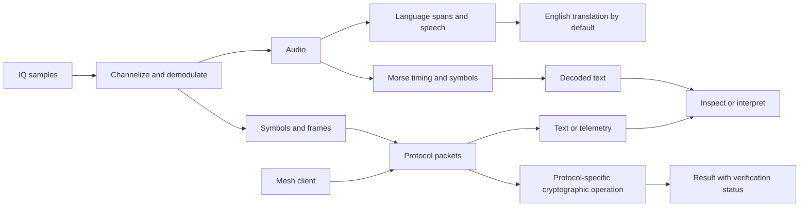

# Signal extensions and workbench

Last updated: 2026-09-20. Status: proposed design for confirmed extension, Morse, historical cipher, and modern cryptography requirements. Release placement and implementation technologies remain open.

## 1. Product intent

Sigy is a serious collection and analysis platform that is also fun to explore. Geographic radio discovery, unfamiliar languages and music, Morse practice, packet inspection, and a visual Enigma machine belong to that intent. A feature can be worthwhile because it is interesting to use and helps explain a signal.

The first release retains its confirmed radio, recording, live translation, and monitoring scope. It establishes the common contracts needed by later signal families. It does not need every future decoder to exist before shipping.

Supporting a new source should usually mean adding an adapter and its tests. Supporting a new interpretation should usually mean adding a transform with declared input/output types. Neither should require duplicating the library, scheduler, CLI operations, or evidence model.

## 2. Extension roles

| Role | Responsibility | Example |
| --- | --- | --- |
| Discovery adapter | Find candidate sources and attach metadata provenance | Radio directory |
| Source adapter | Acquire observations and report capabilities/health | HTTP audio, serial mesh node, SDR, file replay |
| Transform | Derive a typed artifact from supported input | Demodulator, packet decoder, ASR, translator, Morse decoder |
| Cryptographic provider | Perform a specific cryptographic operation with a key reference and profile | Authenticated decrypt, signature verify, historical transform |
| Index/analysis adapter | Produce searchable derivatives or evidence-linked observations | Topic extraction, later music match |
| View | Present existing state and issue application operations | Timeline, spectrum, packet inspector, Enigma trace |
| Export adapter | Package explicitly selected artifacts and provenance | Recording bundle, transcript, signal dataset |

The extension boundary is an application contract, not a commitment to native dynamic-library plugins. Compare built-in modules, supervised processes with a versioned protocol, and constrained portable modules after the stack study. Native DSP, device access, and model acceleration may require different execution boundaries.

## 3. Typed artifacts and time

Every artifact needs identity, schema version, source/session ancestry, input references, completeness, content type, configuration/version provenance, and applicable time/offset bounds. Retained originals and derivatives remain distinguishable.

| Type | Additional contract |
| --- | --- |
| Encoded audio | Codec/container identity, initialization data, presentation timeline |
| PCM | Sample rate, channel layout, numeric format, sample origin |
| IQ or real samples | Numeric format, endianness, sample rate, center frequency where applicable, tuning epochs, dropped-sample indications |
| Spectrum/measurement | Bin or measurement definition, time/frequency interval, units, calibration basis |
| Decoded image/raster | Dimensions, encoding, decoder profile, source/time bounds, completeness and alignment; no assumed OCR or vision analysis |
| Timed symbols/edges | Clock, offset, symbol/transition representation, timing uncertainty |
| Bits/frames | Bit order, framing, protocol hypothesis, error-correction/checksum status |
| Packets/events | Schema/protocol, original payload reference, identifiers, field units, integrity and authentication status |
| Text | Original encoding where known, Unicode content, language observations, event or media alignment |
| Ciphertext/key material | Operation-specific profile and protected key references; never an untyped string accepted everywhere |

An unrecognized type can still be retained and exported if policy permits. A pipeline may start at any supported layer. The service rejects incompatible connections before execution, including mismatched sample formats, absent clock mappings, and unsupported key/operation combinations.

Sample-time mappings survive resampling and channelization. A packet without precise sample linkage does not receive fabricated precision. Completeness and gap metadata propagate to descendants.

Example logical paths, not mandatory processing for every source:



This diagram is illustrative. The actual protocol determines where authentication and decryption occur and whether any text exists.

## 4. Extension contract and lifecycle

A manifest or equivalent built-in descriptor declares adapter ID/version, contract compatibility, configuration schema, capabilities, supported types, required resources, filesystem/device/network needs, state/checkpoint semantics, distribution license, and health diagnostics.

Proposed lifecycle: discover capabilities, validate configuration, negotiate types, reserve resources, prepare, start, emit bounded observations, stop/drain, finalize, release. A failed preparation cannot leave a device tuned or a hidden worker alive. An expired worker generation cannot publish results.

Callbacks and messages are bounded in size and rate. File references use service-issued handles or scoped locations. High-rate IQ needs a data path designed for throughput; copying all samples through the control/event JSON channel is not an acceptable default. Shared memory or direct files remain candidates pending measurement and ownership design.

Adapter configuration and protocol messages are versioned independently from artifact schemas. Unknown optional fields can be preserved when appropriate; unknown required capabilities fail explicitly. Pin each running job to a known configuration and adapter version. An update cannot silently change a decoder halfway through a retained result.

The service owns scheduling and billing. An adapter cannot change retention, spend budgets, source permissions, or monitor goals. A provider that accesses a paid service uses the same budget ledger even when it is a music identifier or another future extension.

## 5. Isolation and trust

Built-in adapters are still parsers of untrusted external material. Isolate fault-prone native decoders and bound their resource use according to the architecture study. An ordinary child process is a crash boundary, not automatically a security sandbox.

Third-party executable plugins require an explicit installation/trust decision. Do not promise safe execution of arbitrary code based only on a manifest or signature. Compare OS sandbox mechanisms and constrained runtimes against required hardware/FFI access before claiming isolation. Automatic installation from source content is outside the proposed design.

Radio metadata, packet payloads, and decoded text never become commands. Render terminal controls safely. Models see only selected content under the monitor's destination policy and receive neither device credentials nor cryptographic keys.

## 6. Multilingual contract across source families

A station or channel contains a time-varying sequence of observations. Its declared language list and its observed language spans are separate fields.

An analysis block carries zero or more detected language spans, with original offsets, candidates, detection granularity, uncertainty, method/version, and revision. Mixed, undetermined, nonlinguistic, unsupported, and detection-failed states remain distinguishable. Use the contract and evaluation plan in [Multilingual research](../../research/10-multilingual-processing.md).

Audio can require speech recognition; a mesh text message can go directly to language detection and translation. Binary telemetry does neither. A Morse result may be a callsign or code group rather than natural language. Instrumental music has no inferred English language.

English is the default translation destination. Preserve source text and script alongside translations. Per-source or per-interval overrides are reversible annotations. A monitor reports actual language coverage and cannot silently replace hard-to-process languages with easier English sources.

## 7. Morse workspace

The workspace opens an existing audio/timing artifact, a later live receive source, or a clearly marked practice session. The user can inspect the original, select a tone/range, adjust timing settings, follow a live result, and replay a suspected error.

Proposed panes:

- Original waveform/envelope or keyed-state timeline with the selected interval.
- Detected marks/gaps and dot/dash sequence, including uncertain symbols.
- Decoded text/prosigns, speed estimate, decoder status, and replay position.
- Controls for play/pause, step, timing profile, correction, and export.

Use independent capture and view cursors so inspecting history does not interrupt collection. Practice text can produce local tones and timed symbols. Learning mode can hide the answer until requested and retain progress locally if that feature is adopted.

The selected International Morse profile and any extra alphabet tables must be explicit. Correct symbols, replay determinism, and usable uncertainty are prerequisites to presenting an attractive decoder as reliable. RF transmission remains a separate capability decision.

## 8. Historical cipher workbench

The workbench is a first-class exploration destination, reachable from a standalone demo or an artifact in the library. Enigma is the initial confirmed example; additional cipher families fit named historical transforms.

Proposed Enigma interaction:

1. Select the documented machine variant and a demo configuration.
2. Inspect rotor order, ring settings, starting positions, reflector, and plugboard.
3. Enter text and inspect any explicit alphabet conversion before transformation.
4. Step a character or run at an adjustable animation speed.
5. See the rotor state before and after stepping and the path through the mechanism.
6. Reset, replay, change a setting, and compare outputs.
7. Save a reproducible demonstration with its input, settings, trace, and implementation version.

Illustrative layout; values are placeholders, not a cryptographic test vector:

```text
SIGY / Workbench / Historical / Enigma
Session: demo     Variant: Enigma I     Position: step <n>
+----------------------+---------------------------------------+
| Configuration        | Rotor state and character path        |
| Rotors / rings       | Before: <state>   After: <state>       |
| Reflector / plugboard| Input -> route -> lamp/output         |
+----------------------+---------------------------------------+
| Input: <message>     | Output: <transformed message>         |
| Trace: <selected character and stepping explanation>         |
+------------------------------------------------------------+
Step   Replay   Reset   Compare settings   Save demonstration
```

A compact text trace carries the same facts on small terminals. Animations are optional, pauseable, and subject to a refresh budget. Library capture and processing continue if the workbench is closed or its rendering falls behind.

Demonstrations do not require model inference, a remote service, or payment. Original historical settings can be stored openly as part of a demo. This does not authorize displaying or exporting operational keys.

## 9. Modern cryptographic operations

Provide operation-specific workflows for authenticated encryption/decryption, signature creation/verification, and post-quantum key encapsulation/decapsulation. Actual algorithms, profiles, encodings, and library versions remain selection decisions supported by [Cryptography research](../../research/12-cryptography.md).

The user chooses an artifact, supported profile, and protected supplied-key reference. The preview identifies output type, destination, relevant public parameters, and verification behavior. Cryptographic operations execute through vetted implementations. A model cannot generate or reinterpret an operational crypto profile.

Preserve original ciphertext and link successful derived plaintext to its input and verification result under the configured retention policy. A failed tag/signature, unsupported profile, wrong key, incomplete stream, and malformed payload have different outcomes. Output publication is atomic where a complete-artifact result is promised. Authenticated chunks and whole-artifact completion have separate status.

Show public key fingerprints and status flow in modern visualizations. Do not show secret intermediate values. No automatic downgrade to a historical or weaker algorithm. Key import, service access, nonce lifecycle, backup/recovery, and secret redaction are acceptance requirements.

Whole-library encryption and encrypted exports are separate potential applications of this capability. They require decisions on searchable metadata, unlocked state, unattended restart, key recovery, and migration before implementation. Adding an encryption button does not solve those product concerns.

## 10. CLI and saved sessions

Proposed families are `sigy source`, `sigy decode`, `sigy workbench`, and `sigy crypto`. Exact commands are open. Every transform can be submitted, inspected, replayed where meaningful, and exported through the shared application service. The TUI visualization consumes trace events and never becomes the only implementation of a transform.

Sensitive keys must not be passed as ordinary command-line strings. A profile uses protected references or a deliberately chosen secure import channel. Machine output is versioned and does not include secret material by default.

A saved workbench session references artifacts, configuration revisions, trace schema, and synthetic/observed status. Copying an experiment produces a new session. User corrections preserve the earlier result.

## 11. Acceptance and sequencing

Acceptance includes type compatibility, schema evolution, worker failure isolation, resource accounting, time mapping, replay provenance, and a demonstration that a new non-audio source can fit the existing library and job lifecycle.

Morse needs independently labeled fixtures. Historical ciphers need known-answer and stepping tests. Modern operations need conformance, interoperability, authentication failure, nonce/restart, and secret-handling evidence. TUI review includes keyboard use, narrow layouts, reduced motion, and simultaneous capture.

Proposed sequencing: establish extension contracts during the first-release foundation; place Morse and historical workbench work in a separate post-release milestone; qualify operational modern cryptography through its own gate. File-based Morse and Enigma need no physical radio. User priority may change that sequencing. No implementation is authorized by this design document.
