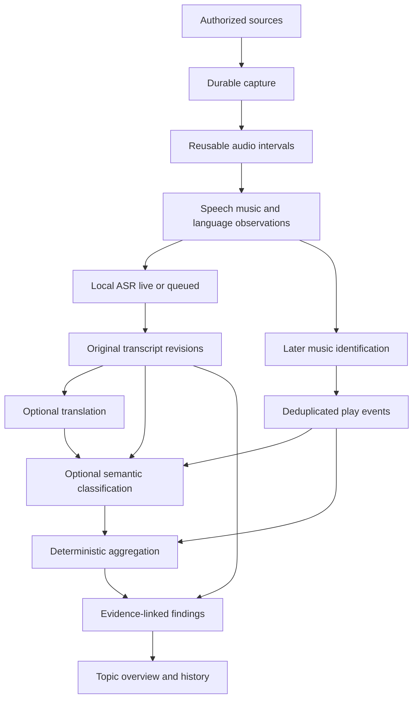

# Analysis, knowledge, and multi-stream processing

Last updated: 2026-09-22. Status: proposed design. The local-processing priority is confirmed; particular recognizers, classifiers, provider routes, and notebook implementation remain undecided. The [language pipeline plan](../development/language-pipeline.md) controls the current retained-recording increment and automated validation method.

## 1. Intended experience

A user can record many stations, see which languages occur, prioritize a few live translations, and queue the rest for local processing. A monitor turns available transcripts into a developing account of a topic. Later, music analysis turns observed plays into weekly views of the monitored stations. The application remains useful with a paid API budget of zero.

Local processing means no metered inference fee. Supported throughput depends on tested hardware and quality profiles. The interface distinguishes how much was captured, detected as speech/music, transcribed, translated, classified, identified, and included in a report. These are separate accomplishments.

The [broadcast analysis contract](../design/broadcast-analysis.md) owns within-station language shifts, candidate advertisement labels and music boundaries. These are overlapping, revisable observations. Preserve unknowns and supporting intervals; neither a station's declared language nor a changing metadata title establishes the current content. A candidate ad cannot silently suppress transcription, topic evidence or retained audio.

Podcasts, prioritized with internet radio before hardware, and later RSS/Atom text feeds reuse these stages and topic records. Finite episodes need media revisions and replay alignment; text entries need content revisions and passage anchors. Process new/changed evidence once where policies allow reuse, with fair queues and explicit backfill limits. Preserve source-specific time and coverage measures in combined insights. [Podcast/feed contracts](02-architecture-and-data.md#11-later-podcasts-and-feeds).

Temporary media is a normal analysis input. Use bounded memory buffers for live windows and durable segments when retries or deferred processing need them. Successful processing records a receipt. The service sweep then deletes that temporary media unless it is kept or archived. Queued work does not silently override storage limits. Keep/Archive protection is explicit. Preserve derived-artifact provenance after raw media expires and label the loss of replayable evidence. The current CLI acknowledgment is manual; automatic receipt generation awaits processing workers.

Research basis: [Local processing and capacity](../../research/17-local-processing-and-capacity.md), [decision models](../../research/16-decision-models-and-classifiers.md), [agentic analysis](../../research/15-agentic-analysis.md), and [aggregation and context](../../research/14-aggregation-and-context.md).

## 2. Separate the processing roles

This diagram describes logical roles, not separate services or a mandatory path through every model. Classifiers receive text or structured metadata. Audio features and song identity require their own qualified detectors or catalog matchers. Statistics use defined application queries over versioned observations.

| Stage | Output | Must not imply |
| --- | --- | --- |
| Activity/language detection | Timed candidates, mixed/unknown state, method and uncertainty | All speech was found or the station uses one language |
| ASR | Original-language provisional/final transcript revisions | Perfect wording, names, numbers, or lyric recognition |
| Translation | Aligned target-language text with source revision | Independent corroboration of the original claim |
| Classification | Labels/scores tied to criteria and exact inputs | Truth, authorization, exact counts, or complete coverage |
| Music matching | Candidate recording identity and match evidence | National popularity or correct version without qualification |
| Aggregation | Reproducible counts/rates with sample definition | A representative population survey |
| Synthesis | Supported findings and contextual narrative | Permission to invent missing evidence |

## 3. Scheduling and local capacity

Capture has its own admission and storage budget. Processing stages have separate queues, capacity reservations, and freshness/completion targets. Selecting eight recordings must not silently promise eight concurrent live translations.

Proposed user policies:

- **Live:** prioritize bounded-latency processing, display provisional/final state and delay, and retain catch-up work according to the saved policy.
- **Batch:** queue retained intervals for a chosen local quality profile and optional processing window.
- **Live plus refinement:** publish a qualified live result and later create a clearly identified higher-quality revision.

These are interface concepts, not implemented commands. Common setup should show source count, estimated storage, selected languages/profiles, local capacity status, and paid allowance. Avoid exposing classifier details until the user opens advanced analysis settings.

Reserve finite queue storage and protect required input intervals while admitted work is pending. Track oldest item, queued audio duration, estimated work, and processing rate. If new arrivals outrun throughput, report that the queue cannot currently catch up. Do not display a finite completion estimate based only on backlog size.

Use fairness between sources, bounded batch waits, and an allocation for older work. Model sharing and batching are optimizations subject to memory and privacy boundaries. Unknown languages, missing models, or failed workers produce explicit waiting/unsupported/error states. They do not authorize a cloud call.

Live recognition, local batch throughput, and capture concurrency are independently qualified on both machine classes. A $0 paid budget does not disable local analysis. A full disk or unsustainable queue still requires a visible policy outcome.

## 4. Decision adapter contract

The analysis boundary should accommodate rules, local classifiers, a constrained local text model, or an explicitly configured hosted decision provider. Jev through OpenRouter is an evaluation candidate. Its special endpoint must not be forced through a chat-completions abstraction.

An analysis request records:

- Input artifact IDs and revisions, exact passage bounds, language observations, and whether text was translated.
- Task and taxonomy version, full question/label definitions, examples if used, and permitted outputs including unknown/other.
- Required capabilities, model/version policy, effective destination, deadline, resource limits, and paid reservation identity when applicable.

A result records selected labels, raw scores/distributions, distinct provider confidence fields, abstention/reason, resolved model and provider, usage/cost evidence, and the thresholds/calibration profile used. An adapter may not provide probabilities; mark them unavailable instead of manufacturing a common confidence scale.

Deterministic validation checks types, ranges, label membership, input identity, and revision currency. Decision acceptance depends on an evaluated task/language profile. Do not silently reinterpret a confidence field from one model as the probability used by another.

Independent questions can share a request when the provider supports it. Decisions depending on earlier outputs need separate stages with their own admission. Unsupported languages and conflicting results can route to a permitted local alternative, remain unknown, or wait. The selected user policy determines which.

Classifiers may prioritize deeper analysis. They do not decide raw-data retention, enforce security policy, or prove a topic was absent. Keep a bounded audit sample and exploration allowance so incorrect filtering does not permanently hide emerging subjects. Qualified thresholds should favor the appropriate precision/recall tradeoff for each monitor.

## 5. Durable topic context

The first release needs a topic overview, evidence list, timeline, and changes since the previous report. A richer linked notebook is a proposed extension of those views rather than a prerequisite for an additional knowledge-management product.

| Record | Essential properties |
| --- | --- |
| Monitor specification | User goal, source/language scope, schedule, limits, version and authority |
| Monitor action | Proposed source change, recorded selection basis, applicable policy version, admission decision, execution outcome and resource/cost references |
| Analysis decision | Input revisions, criteria, scores, model identity, acceptance policy |
| Finding | Claim type, wording, support/contradiction links, time bounds, uncertainty, revisions |
| Entity reference | Original name/script, aliases, candidate identity links and merge provenance |
| Topic projection | Overview and timeline built from a named finding set, with generation history |
| User annotation | Authored correction/context, attachment scope, revision and conflict handling |
| Coverage snapshot | Eligible/selected sources, captured and processed intervals, gaps, unknowns, deduplication basis |

Collected evidence is immutable while retained. Interpretations can be revised. Current monitor checkpoints are operational state. User policy and curated context are authoritative only within their explicit scope. A generated notebook cannot silently edit permissions or become executable instructions.

Both clients must let a user follow a finding through the exact translation and original transcript revisions to the retained recording interval and surrounding context. Preserve source, timing, language observations, location basis, processing method, and gaps along that path. Distinguish observations, mechanically checked properties, model interpretations, supplied context and unresolved alternatives. A translation is not independent support for the claim it translates.

On a scoped correction to a name, language span, transcript or interpretation, changed track identity, entity merge, or new model pass, identify and mark dependent results stale. Record the corrected revision and expose the affected results. Recompute only through the existing resource, destination, retention and spending policy; a correction cannot authorize paid fallback or restore expired source material. Preserve earlier report snapshots and leave unavailable or deferred results visibly stale. Concurrent corrections must expose revision conflicts rather than silently overwrite another correction. Retention/deletion must label missing support and propagate privacy deletion where required.

Briefings retain conflicting reports and duplicate/syndicated-source relationships, including unknown independence. Repeated statements and translated copies must not inflate corroboration. Monitor history explains recorded decisions and outcomes within the user's collection policy, with references to actual actions and costs. Missing decision evidence stays unknown instead of being filled by a generated retrospective explanation.

Allow Markdown and structured export with stable IDs, evidence references, timestamps, coverage, and revisions. The transactional catalog remains responsible for jobs and budgets. Search indexes and topic projections should be rebuildable from the retained records that produced them.

## 6. Statistical meaning and weekly music analysis

Music intelligence remains after the first release. Plan the full path now: raw station metadata, music intervals, candidate identities, reconciled recording/version IDs, deduplicated play events, and exact sample-qualified aggregates.

Define a weekly report using an explicit time zone and half-open interval `[start, end)`. A proposed rule assigns a play count to its start time and clips airtime to the report window. Crossfades, partial captures, restarts, metadata changes, simultaneous duplicate URLs, and one long track detected many times need fixtures before the rule is accepted.

Keep these quantities distinct:

- Observed plays and distinct monitored stations carrying a recording.
- Identified airtime, unidentified music airtime, and total captured/eligible station-hours.
- Plays per monitored station-hour and each recording's share of identified music airtime.
- Week-over-week movement on a stable station panel, alongside the full changing sample.
- Regional/catalog identification coverage, track-version ambiguity, and metadata-only versus fingerprint-supported matches.

An unknown interval stays in the appropriate coverage denominator. Do not exclude poorly identified regions until the remaining results look comprehensive. Display station country, artist origin, and song language as separate attributes with provenance. Avoid inventing any of these from names alone.

Classifiers can label a known item or passage against explicit semantic categories. Counts, ordering, interval arithmetic, ranking, and rates are computed deterministically. Summing model scores is not a verified count; any probabilistic estimate would need a separately labeled and validated statistical method.

Label the result, for example, "Most observed songs across your monitored stations this week." It is not a continent-wide popularity chart. Coverage changes can explain apparent trends; compare a stable panel and flag methodological changes before making a narrative claim.

## 7. Cost and degradation behavior

The [provider policy](07-providers-and-cost-policy.md) governs every hosted stage. Classification receives a visible stage allowance within the overall budget. Repeated small requests, fan-out, provider fallback, translation, and synthesis cannot escape the shared cap.

Reuse compatible work across monitors without counting one physical request twice. Define how shared costs are attributed for reporting while retaining one authoritative liability record. Strict enforcement operates on actual reservations, not on estimated savings from caching.

At a classifier cap, pause that stage or use an already permitted local alternative. Reports show partial classification and pending work. Healthy capture, completed transcripts, music observations, and locally computable statistics remain available within their independent limits. Never present unclassified or unidentified content as a negative observation.

## 8. Validation before implementation selection

Specify and later execute comparison workloads for multilingual detection/ASR, live-versus-batch scheduling, end-to-end classifier cascades, topic evolution, and weekly music reports. Use licensed majority non-English reference fixtures, preserved originals, held-out stations/time windows, and language-specific thresholds. Current language evaluation uses published references, deterministic metrics, and calibrated independent model checks without depending on new human reviewers. Record the actual review method and preserve uncertainty.

Required failure cases include detector mistakes, unsupported language, translation distortion, rare-topic filtering, stale revisions, taxonomy changes, duplicate evidence, hidden provider retries, exhausted budgets, growing backlog, retention conflicts, and restart during a topic update. Acceptance evidence must demonstrate useful analysis as well as bounded resources and recoverable state.

No pipeline described here has been implemented or benchmarked. These contracts inform the technology trade study; they do not pick its winner.
