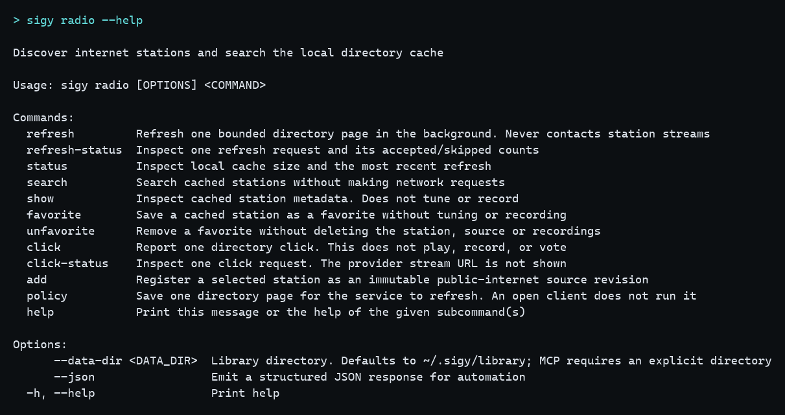
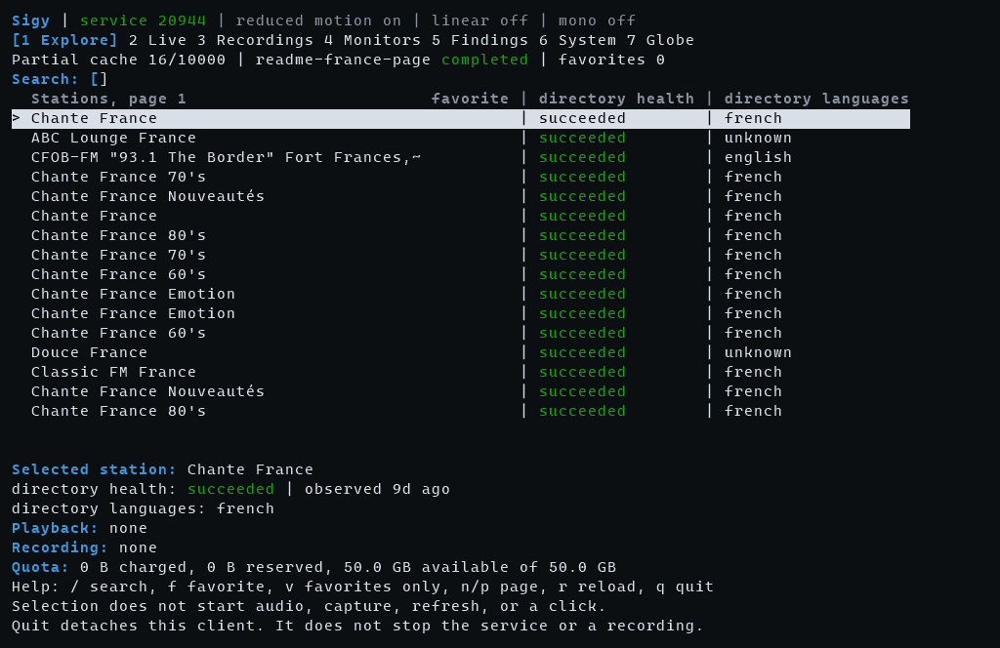
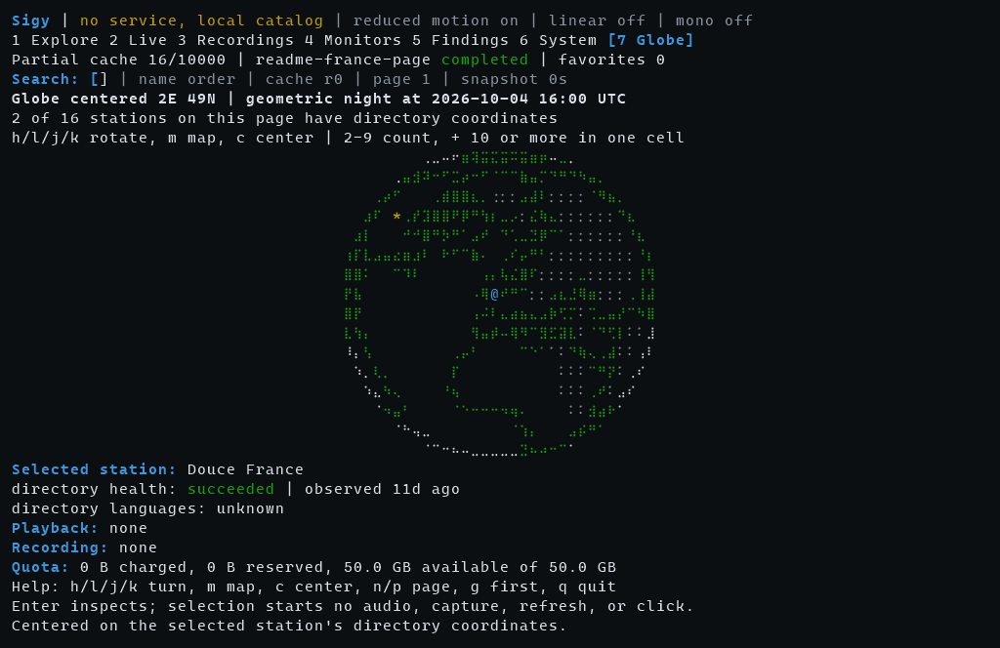

# Using Sigy

This is the command reference for the current checkout. Examples use `sigy` after [installation](install.md). From the repository without installing, put `cargo run --locked -p sigy --` in front of the same arguments. Planning documents describe later behavior. A command is current only when it appears here or in `sigy --help`.

Commands use `~/.sigy/library` by default: `%USERPROFILE%\.sigy\library` on Windows, `$HOME/.sigy/library` on Unix. `--data-dir PATH` selects another library and works before or after a subcommand. Use a private directory outside the checkout. MCP requires an explicit `--data-dir`; help, version, updates and backup verification or restore do not need a library. `--json` emits one structured response for automation. Every argument in `--help` states its meaning, unit or accepted range. Page sizes outside the service bounds are refused before any request, for example `radio search --limit` accepts 1 to 16. Common failures add the next command: a missing recording names `sigy record list`, `service status` without a running service says so, a service-only command says to run `sigy service start`, and an unresolved `--decoder` asks for an absolute ffmpeg path. Amounts in JSON are exact decimal USD strings. Displayed origins omit paths and queries. Full URLs stay in the private catalog in plaintext. Do not put access credentials in source URLs.

Catalog schema is v48 and local IPC is v49. Stop an older service with its existing binary before replacing that binary, then start it again. `service run` keeps the controller in the foreground. `service start` detaches it from the client. Neither command installs an operating-system startup service. The service holds the library lock. Other commands reconnect to it while it is running.

## Quick start

```text
sigy init --radio
sigy tui
```

`init` creates or reopens the library, preserves existing configuration and starts or reconnects to its service. A new library has paid processing disabled. `--radio` explicitly fetches one page of at most 100 stations; it starts no station playback, recording or inference. Setup waits up to 15 seconds for that refresh, then reports its actual state and the follow-up command. Repeating setup reuses the `sigy-init-radio-v1` request without another fetch. Use `radio refresh NEW_ID` when you want a new page.

`sigy init` omits the directory fetch. `sigy init --no-start` only prepares local storage and never starts a service; `--no-start` conflicts with `--radio`. Starting an existing library can resume its already authorized schedules, processing and refresh policies; setup does not reset them or their spending limits. Other commands never initialize a missing library implicitly. See [first use](install.md#first-use).

## Update

```text
sigy update --check
sigy update
```

`sigy update` fetches `main` from <https://github.com/blisspixel/sigy> and installs that commit with Cargo. When GitHub CLI is logged in, Git uses that login. `--check` fetches and checks out the managed source tree, then reports the binary's embedded commit, or a legacy installed marker, and that tip without installing. It refuses a dirty or different-origin managed checkout and exits with an error when no commit is recorded or a newer commit is available. The command does not select a library, contact a station, or run `cargo verify`. On Windows the install finishes after this process exits, because Windows cannot replace the running executable. Let active recordings finish, then stop the service before that replacement.

## Doctor

```text
sigy --data-dir PATH_TO_LIBRARY doctor
sigy --data-dir PATH_TO_LIBRARY doctor --strict
```

`doctor` reads the local library and does not refresh, delete, or contact a network. It first says whether the service is running for that library. It reports each check as ok, attention, or blocked. Attention means the library still works and names the full `sigy` command that would improve it; add the same `--data-dir` when you used one. Blocked means a configured check is unusable, and the process exits with an error. `--strict` also exits with an error when any check needs attention.

An empty station cache, a cached station older than 24 hours, or a cached station with no observation time is attention. Those stations stay searchable. Favorites stay. Doctor also runs SQLite `quick_check` and does not print the engine's own error text. A refresh merges one page and does not delete unseen stations. The report suggests `radio refresh NEW_ID --limit 100`. Choose a new id for each fetch. A running refresh is reported instead of starting another one. Podcast snapshots older than 24 hours are attention and are not downloaded by that suggestion. A missing decoder is attention until recording is required. A configured decoder path that is not a file is blocked, and recording refuses to start. Doctor also reports the pace of completed recognition on this library, or that the pace is unmeasured. That check stays ok. It is the wall time of those jobs per second of retained audio. The same pace is the delay that keeps a monitored recognition job live after its last seal. The check also reports the wall time of queued recognition audio at that pace. That figure is the processing time of audio already waiting on this library. A running or stopping recognition job is counted on its own. The check does not admit work. It also reports recognition worker cost from the snapshot that proved each recognition group empty: the highest job-object peak committed memory and the CPU sum on this library, or that the cost is unmeasured. Groups without job-object accounting stay out of that figure. The figure is not a host budget. It also compares the retained audio of admitted recognition jobs with the busy time of completed recognition. The sentence says whether admissions brought more, the same, or less audio per wall millisecond, or that the comparison is unmeasured. It is not a clock time for an empty queue and it is not a host budget.

## Library and budget

```text
sigy --data-dir PATH_TO_LIBRARY library init
sigy --data-dir PATH_TO_LIBRARY library status
sigy --data-dir PATH_TO_LIBRARY budget show
```

`library init` creates the catalog with paid processing disabled. `budget set` can store a finite limit. It does not configure or call a provider. Provider dispatch is unavailable.

### Backup and restore

```text
sigy --data-dir PATH_TO_LIBRARY service stop
sigy --data-dir PATH_TO_LIBRARY library backup NEW_BACKUP_DIRECTORY
sigy library verify-backup BACKUP_DIRECTORY
sigy library restore BACKUP_DIRECTORY --into NEW_LIBRARY_DIRECTORY
```

A backup copies the catalog and every retained recording into a new directory with a manifest of sizes and SHA-256 hashes. Stop the service first; a backup refuses a library the service holds. `verify-backup` checks every file against the manifest. `restore` verifies the backup, builds the new library beside the destination, checks that every recording the catalog needs is present, and only then moves it into place, so a failed restore leaves nothing behind. On its next start, the service applies each job's recovery rules. Tracked native withdrawal without committed completion remains cancelling and holds its protected resources and new native claims; it is not treated as proven interrupted cleanup. Backups are not encrypted and hashes are not signatures; store them somewhere you trust. See [backup and restore](decisions/0045-library-backup-and-restore.md).

## Service

```text
sigy --data-dir PATH_TO_LIBRARY service start
sigy --data-dir PATH_TO_LIBRARY service status
sigy --data-dir PATH_TO_LIBRARY service stop
```

`service run` is the foreground form of the same controller. Shutdown lets admitted changes finish. Client exit does not stop the service.

## Sources

```text
sigy --data-dir PATH_TO_LIBRARY source add demo:v1 --name "Radio example" --url https://radio.example/audio
sigy --data-dir PATH_TO_LIBRARY source list
sigy --data-dir PATH_TO_LIBRARY source show demo:v1
```

Registration stores the configuration and does not contact the station. Reusing a revision key cannot change its URL, name, network permission, or redirect policy. Public-internet access is the default. `--pin-address` binds a revision to one supported IP, including a private or loopback address. Lists are paginated with `--limit` and `--after`.

See [source authority and transport](decisions/0004-source-authority-and-http.md).

## Radio directory

Browse countries and territories offline before initializing a library or fetching stations:

```text
sigy radio countries
sigy radio countries Congo --locale fr
sigy --json radio countries Canada
sigy radio countries --licenses
```

The bundled CLDR 48.2.0 reference supplies 257 country/territory identities independently of cached stations. Display locales are `en`, `fr`, `es`, `ar`, `hi`, `zh`, `pt`, `sw`; other locales explicitly fall back to English, including regional tags such as `fr-CA`. Pages contain at most 16 codes, with a continuation bound to the query, requested/display locale and reference version/hash. Structured output includes reference and matched-alias provenance. Station availability remains unknown in this view; a reference entry does not imply directory coverage. `--licenses` prints the preserved legal notices.

Existing `--country` filters accept a unique reference name or a literal two-letter provider code, including an unlisted code. Names preserve accents and scripts and search aliases from all eight bundled locales. Ambiguity considers every matching identity before paging: `Congo` requires `CD` or `CG`, and a more general name can match several territories. Choose an explicit code from `radio countries` when ambiguous. City and coordinate/radius lookup remain planned. See [offline country selection](decisions/0080-offline-country-reference.md).



Start the service, then request one directory page:

```text
sigy --data-dir PATH_TO_LIBRARY radio refresh french-news-001 --language french --tag news --limit 100
sigy --data-dir PATH_TO_LIBRARY radio refresh-status french-news-001
sigy --data-dir PATH_TO_LIBRARY radio search --language french --tag news
sigy --data-dir PATH_TO_LIBRARY radio show STATION_UUID
sigy --data-dir PATH_TO_LIBRARY radio add STATION_UUID --revision selected:v1 --redirects public
```

Wait until the refresh status is completed, then replace `STATION_UUID` with an id from search. Search supports `--name`, `--country`, `--language`, `--tag`, `--healthy`, and pagination. It reads the partial local cache and does not use the network. Refresh uses the network only when requested. Choose a new refresh id to fetch again. Refresh and registration do not contact station streams, play audio, or run analysis.

`radio search` preserves UUID order by default. Use `--order name` for the same stable name order as the terminal explorer. Names compare through pinned Unicode normalization and case folding, with UUID ties; originals retain their scripts and accents. This is deterministic ordering, not locale collation. Continue with the printed opaque `--after` cursor, the same order, filters and `--limit`. A successful refresh or actual favorite change invalidates old name cursors. Restart explicitly without `--after`; failed refresh and no-op favorite requests preserve the revision. [Ordered search](decisions/0081-ordered-station-search.md) describes the finite work and response bounds.

```text
sigy --data-dir PATH_TO_LIBRARY radio policy set french-news --language french --tag news --every-hours 24
sigy --data-dir PATH_TO_LIBRARY radio policy show french-news
sigy --data-dir PATH_TO_LIBRARY radio policy clear french-news
```

A saved policy is one bounded page. The interval is 1 to 168 hours, and the first fetch waits for that interval. The service admits the current slot. A missed slot is not backfilled. A completed, failed, or interrupted slot is not fetched again. One refresh runs at a time. Opening the command line or the list explorer does not fetch a page, probe a station stream, or send a click. A failed refresh leaves the last usable cache. Favorites stay. `sigy doctor` reports age and does not run the policy. See [directory refresh policy](decisions/0030-directory-refresh-policy.md).

Observation age and directory health are separate from stream compatibility. Directory languages are hints, not detected speech. No broadcast detector is implemented. See [broadcast analysis](design/broadcast-analysis.md) for the planned contract.

```text
sigy --data-dir PATH_TO_LIBRARY radio favorite STATION_UUID
sigy --data-dir PATH_TO_LIBRARY radio search --favorites --language french
sigy --data-dir PATH_TO_LIBRARY radio unfavorite STATION_UUID
```

Favorites work offline and survive catalog updates and service restarts. Removing a favorite preserves the station, registered sources, and recordings. See [favorites](decisions/0008-radio-favorites.md).

```text
sigy --data-dir PATH_TO_LIBRARY radio click heard-001 --station STATION_UUID
sigy --data-dir PATH_TO_LIBRARY radio click-status heard-001
```

A click does not play the station. The stream address in the provider response is discarded. Search, show, favorite, and refresh do not send this request. Reusing the click id does not send it again. See [directory clicks](decisions/0010-directory-clicks.md).

`radio add` stores a metadata snapshot and registers the chosen public stream as an immutable source. Use that revision with `record start --source`. `--redirects public` permits at most three redirects to checked public-internet destinations. Omit `--redirects` to deny them, or choose `same-origin` to stay within the original scheme, host, and port. HTTPS cannot downgrade to HTTP. Existing revisions keep their policy. Choose a new revision key to change it. See [directory behavior](decisions/0006-radio-discovery.md) and [redirect policy](decisions/0007-authorized-redirects.md).

## Playlists

```text
sigy --data-dir PATH_TO_LIBRARY source playlist resolve playlist-001 --revision playlist:v1
sigy --data-dir PATH_TO_LIBRARY source playlist status playlist-001
sigy --data-dir PATH_TO_LIBRARY source playlist accept playlist-001 --index 0 --revision chosen:v1 --name "Chosen stream"
```

One request reads one playlist document, allows at most 32 entries, and does not open those entries. An HLS master playlist lists its variants and audio renditions with the declared bandwidth, codecs, and whether the declared codecs are audio only. Those are publisher claims. Nothing fetches a variant or picks one for you; prefer an audio-only variant for radio. An HLS media playlist fails the resolve and stores no candidates; record it with `record hls`. A directory HLS flag does not block a resolve. Accepting an index registers a new audio revision and does not connect. Reusing the request id does not fetch again. Reusing the same accept does not register again. Resolving or accepting a playlist does not play it. See [playlist resolution](decisions/0009-playlist-resolution.md).

## Podcasts

```text
sigy --data-dir PATH_TO_LIBRARY podcast subscribe show:v1 --url https://show.example/feed.xml
sigy --data-dir PATH_TO_LIBRARY podcast show show:v1
sigy --data-dir PATH_TO_LIBRARY podcast unsubscribe show:v1
```

The feed URL, network scope, address pin, and redirect policy are immutable. Reuse of the same id cannot change them. The default redirect policy is deny. Subscribe does not resolve DNS, download the document, register an audio source, or start a capture. Unsubscribe stops future polls and deletes nothing.

```text
sigy --data-dir PATH_TO_LIBRARY podcast refresh show:v1 --id feed:v1
sigy --data-dir PATH_TO_LIBRARY podcast refresh-status feed:v1
sigy --data-dir PATH_TO_LIBRARY podcast episodes show:v1
```

Refresh reads one RSS 2.0 document on the shared acquirer. A compressed body is at most 2 MiB, the decoded document is at most 8 MiB, and the expansion ratio is at most 16. At most 500 items are committed. Further items mark the snapshot truncated. A failed document leaves the last good snapshot. Omission from a later snapshot does not delete an episode. Transcript and chapter URLs are stored and are not fetched by refresh. A live item is counted and not opened. Episode titles are not identity. Listing episodes works offline.

```text
sigy --data-dir PATH_TO_LIBRARY podcast download show:v1 --episode EPISODE_ID --id episode:v1 --revision enc:v1
```

`EPISODE_ID` comes from `podcast episodes`. The service registers an immutable audio revision for that URL under the subscription grant, reserves 512 MiB and 30 minutes before connecting, and publishes a clean ended file. Radio attempts stay 15 minutes and 256 MiB. A declared length above 512 MiB is rejected before connect. Replay of the same recording id does not download again. Download does not fetch transcripts or chapters.

```text
sigy --data-dir PATH_TO_LIBRARY podcast text show:v1 --episode EPISODE_ID --kind transcript --index 0 --id text:v1
sigy --data-dir PATH_TO_LIBRARY podcast text-show text:v1
```

`podcast text` fetches one stored transcript or chapter document when asked. `--kind` is `transcript` or `chapters`. The result is unverified publisher text. Cue times are publisher times, not media time, and the text is not an automatic transcript. The bytes do not change the recording quota. Replay of the same id does not fetch again. HTML is rejected before connect. Nested chapter image and link URLs are not requested. Restart marks a running fetch interrupted and leaves the previous snapshot.

```text
sigy --data-dir PATH_TO_LIBRARY listen file episode:v1 --destination null
```

The episode has no live edge, so `listen source` on that revision fails before a request. Subscribe and refresh do not start playback. The tested recording stays temporary under the default 14-day and 50 GB policy, and playback does not change charged bytes.

See [subscriptions](decisions/0017-local-podcast-subscriptions.md), [RSS refresh](decisions/0018-rss-feed-refresh.md), [enclosure download](decisions/0019-episode-enclosure.md), [retained playback](decisions/0020-retained-episode-playback.md), and [publisher text](decisions/0022-publisher-text.md).

## Recording and retention

```text
sigy --data-dir PATH_TO_LIBRARY dvr configure --decoder ABSOLUTE_PATH_TO_FFMPEG --quota-gb 50 --retention-days 14
sigy --data-dir PATH_TO_LIBRARY service start
sigy --data-dir PATH_TO_LIBRARY record start morning-001 --source demo:v1 --seconds 60 --max-mib 64
sigy --data-dir PATH_TO_LIBRARY record show morning-001
sigy --data-dir PATH_TO_LIBRARY record path morning-001
sigy --data-dir PATH_TO_LIBRARY record metadata morning-001
sigy --data-dir PATH_TO_LIBRARY record keep morning-001
sigy --data-dir PATH_TO_LIBRARY dvr status
```

Pass the absolute path of the installed FFmpeg executable to `dvr configure --decoder`; `PATH` is not searched. Sigy does not download it. `dvr status` shows decimal sizes beside the exact byte counts. `record start` returns while the service continues. Poll `record show` until the attempt is completed or failed. `record path` prints a verified retained file's path. Add `--icy` only when interleaved stream titles should be stored as observations. The default is off, and those titles are not written into the audio file. See [ICY observations](decisions/0013-icy-observations.md).

```text
sigy --data-dir PATH_TO_LIBRARY record hls segment-001 --source media:v1 --seconds 60 --max-mib 64
```

`record hls` records one finite media playlist. The document must include `#EXT-X-ENDLIST`. At most 32 segments share that recording's time and byte ceiling. The service publishes one local file through the same decoder check, hash, and quota. A master playlist fails before a variant request; resolve it and accept one variant first. Encryption, a media map, a byte range, discontinuity, and partial segments are rejected. Segments may be MPEG transport streams served as `video/mp2t`, recorded with the format `mpegts`, or ADTS AAC served as `audio/aac`. The decoder receives the published file, not an `.m3u8` address. See [HLS media playlists](decisions/0012-hls-media-playlist.md).

```text
sigy --data-dir PATH_TO_LIBRARY source playlist resolve station-hls --revision station-master:v1
sigy --data-dir PATH_TO_LIBRARY source playlist status station-hls
sigy --data-dir PATH_TO_LIBRARY source playlist accept station-hls --index 1 --revision station-audio:v1 --name "Station audio"
sigy --data-dir PATH_TO_LIBRARY record hls live-001 --source station-audio:v1 --seconds 60 --max-mib 16 --live
```

`record hls --live` records a live media playlist. It starts three segments before the live edge, reloads the playlist about once per target duration and never sooner than once a second, fetches each new segment once, and appends segments in order until `--seconds`, `--max-mib`, or `record stop`. Only whole segments are published. The capture ends at the first skipped sequence, discontinuity, failed or stalled reload, failed segment, or media type change. The segments received before it are published with the end reason `stream_gap`, and the rest of the plan is a gap with that cause. The capture does not resume after a gap, and a failed reload is not retried. A live playlist without `--live` fails, and an ended playlist with `--live` fails. Live recording is tested on loopback fixtures only; no public station is qualified. See [live HLS](decisions/0042-live-hls.md).

A published file has one measured interval: decoded duration and published byte length, both starting at zero. The requested window stays the plan. A recording that has not been published has no interval. See [measured intervals](decisions/0023-recording-intervals.md).

```text
sigy --data-dir PATH_TO_LIBRARY record pause morning-001
```

`record pause` stops a running capture. The part of the plan with no published audio becomes a gap. A disconnect, service recovery, codec change, refused segment renewal, and a backward clock write a gap with that cause. A live HLS capture adds `sequence_skip`, `discontinuity`, and `reload_failure`. A gap is not a silence file. `listen file` refuses a seek inside a gap and plays one sealed segment, including while the capture is still running. The open tail is not readable. See [capture gaps](decisions/0026-capture-gaps.md), [segment playback](decisions/0027-segment-playback.md), and [segment retention](decisions/0028-segment-retention.md).

```text
sigy --data-dir PATH_TO_LIBRARY listen attach listener-a --recording morning-001
sigy --data-dir PATH_TO_LIBRARY listen pause listener-a
sigy --data-dir PATH_TO_LIBRARY listen seek listener-a --seek-us 200000
sigy --data-dir PATH_TO_LIBRARY listen live listener-a
sigy --data-dir PATH_TO_LIBRARY listen play listener-a --destination null
sigy --data-dir PATH_TO_LIBRARY listen detach listener-a
```

`listen pause` stores that playhead. It does not stop the capture and does not write a gap. `listen seek` moves it only inside one published segment, and only inside that segment's decoded duration. A gap and the open tail are refused. `listen live` parks at the end of the newest published segment and does not read the open tail. `listen play` plays that sealed file in this client and then drops the playhead. Leaving it does not stop the capture. `listen detach` drops a playhead that is still attached. A second attach is another playhead on the same recording. A paused position that falls before the earliest retained segment is expired until the listener seeks or returns to live.

Default retention is 14 days and 50 GB of managed media. A temporary recording may stay while it is processed. `record keep` and `record archive` keep it, and those bytes still count toward the quota. `record hold ID --start-us START --end-us END` protects every published segment that range intersects and records a gap inside that range. The open tail stays temporary. Aged temporary segments lose their files. A processing receipt does not protect those files. Archive does not create a backup. New recordings fail when protected media fills the allowance. `record temporary` restores rolling retention. `record processed ID --receipt RECEIPT_ID` records that processing finished. It does not run analysis. The service sweep then deletes that temporary file. The same sweep deletes other temporary recordings older than the retention window. Quota pressure removes the oldest temporary recordings sooner. `dvr prune` runs that same reclaim. `record delete` deletes inactive media even when Keep or Archive is set and keeps the catalog history. An active or cancelling analysis reader blocks deletion and reclamation until it stops.

Direct audio, explicitly permitted redirects, one finite or live HLS media playlist, and explicit ICY metadata on `record start --icy` are the current recording profile. A radio attempt is at most 15 minutes and 256 MiB, with up to two active attempts. On Windows, with FFmpeg 9.0.1, one local session decoded direct WAV, MP3, AAC served as `audio/aac`, FLAC, and Ogg Vorbis. The same session decoded WAV from one accepted playlist entry behind one same-origin redirect and played that revision to `--destination null`. The fixture contacted only 127.0.0.1. One session is not a support matrix. A later loopback fixture on the same host decoded live HLS AAC segments in MPEG transport streams and as ADTS, cut from a local tone by that FFmpeg. See [decoded formats](decisions/0014-decoded-formats.md) and [live HLS](decisions/0042-live-hls.md).

Playlist media types still fail on `record start`. A listen, an HLS recording, and `record start` without `--icy` still reject `icy-metaint` before writing audio. A body that hits a ceiling without a clean end is not playable. Continuous segmented recording is not qualified yet. Failed and partial bytes keep their reservation and are not offered as playable media. See [recording and retention](decisions/0005-recording-and-retention.md) and [recording metadata](design/recording-metadata.md).

## Schedules

```text
sigy --data-dir PATH_TO_LIBRARY schedule create morning --source local:v1 --zone America/New_York --daily 06:00:00 --seconds 900 --max-mib 64
sigy --data-dir PATH_TO_LIBRARY schedule create once-001 --source local:v1 --zone Etc/UTC --once 2026-09-23T06:00:00 --seconds 900
sigy --data-dir PATH_TO_LIBRARY schedule create weekly-001 --source local:v1 --zone Europe/Paris --weekly mon --at 18:30:00
sigy --data-dir PATH_TO_LIBRARY schedule show morning
```

A rule binds one source revision, one IANA time zone, and one civil clock. The recurrence is once, daily, or weekly. Duration and bytes stay inside the radio ceiling of 15 minutes and 256 MiB. Only the next occurrence is stored. The service admits that occurrence when its window is open and a decoder file is configured. A second admit does not create another job. A window that has already ended stays missed and is not backfilled. A civil time that does not exist, such as a spring-forward hour, is missed. A repeated fall-back hour uses the earlier offset once. Changing a rule does not rewrite an occurrence that was already admitted. A late admit records a prefix gap for the missed start and keeps the original plan bounds. No analysis profile can be attached. See [recording schedules](decisions/0029-recording-schedules.md).

For a monitor version with explicit capture limits, append `--monitor MONITOR --monitor-version VERSION` when creating a new rule. Its immutable owner requires the current inspected version and a source the monitor currently follows. An existing independent rule cannot be adopted. Every owned admission checks the current capture policy, reserves the full planned seconds and maximum bytes, and keeps its policy version and digest in `schedule show`. A changed policy can hold future admissions. Independent rules retain their authority. See [monitor-owned capture schedules](decisions/0065-monitor-owned-capture-schedules.md).

## Analysis

```text
sigy --data-dir PATH_TO_LIBRARY analysis admit pin-001 --recording RECORDING
sigy --data-dir PATH_TO_LIBRARY analysis show pin-001
sigy --data-dir PATH_TO_LIBRARY analysis publish pin-001 --revision 1
sigy --data-dir PATH_TO_LIBRARY analysis admit pin-001 --recording RECORDING --replace-worker
sigy --data-dir PATH_TO_LIBRARY analysis verify verify-001 --input pin-001 --revision 1
sigy --data-dir PATH_TO_LIBRARY analysis job verify-001
sigy --data-dir PATH_TO_LIBRARY analysis cancel verify-001 --generation 1
sigy --data-dir PATH_TO_LIBRARY analysis languages list pin-001 --revision 1
sigy --data-dir PATH_TO_LIBRARY analysis languages show EVIDENCE_ID --revision 1
```

`analysis admit` pins one completed recording. The pin stores the retained checksum and the media clock. Published intervals keep their bounds. A capture gap stays a gap, and planned time with no audio is an uncovered gap. The pin does not include a source URL. `record processed` records a cleanup receipt and does not create this pin. An unpublished recording, or a checksum that does not match the published interval, is refused. `--replace-worker` retires an unpublished revision. Publishing that older revision fails. `analysis admit` does not transcribe and does not reserve a paid budget. See [analysis inputs](decisions/0031-analysis-inputs.md).

`analysis verify` requires a running service and checks retained input in one supervised local job. It reads at most 512 MiB across 1024 files, with a 64 KiB buffer and cancellation/deadline checks between reads. A blocked filesystem read can delay the 60-second deadline; the recording remains protected until the reader actually stops. These commands perform no recognition, translation, or paid request. See [retained-input verification](decisions/0034-retained-input-verification.md).

Verification, recognition and translation jobs share one durable queue in the service. A new job is `queued` and starts when a slot of its kind is free (one verification, one recognition and one translation at a time) and no other job on the same pin or transcript is running. Waiting jobs rotate across sources. Every fourth claim takes the oldest waiting batch job, so one busy source cannot hold the slot. Jobs from one source still run oldest first. A recognition job is live when an unpaused monitor follows its source and the current time is still within the recording's last seal plus the retained audio at that profile's measured pace. Doctor reports that pace, and profiles it does not name still count. Doctor also reports the wall time of queued recognition audio at that pace, which is the processing time of audio already waiting on this library. A running or stopping job is a count, and verification and translation are omitted from that sentence. Verification, translation, an unmeasured profile, a paused monitor, and a passed deadline stay in arrival order. The deadline is not stored. A new recording still publishes while recognition is queued, including after the monitor that follows its source is paused. That recording stays out of the doctor sentence until a recognition job exists. A capture gap is not audio. `analysis job` reports queued, running, cancelling, the result state, cancelled, failed, or interrupted, with the generation and attempt. `analysis cancel` ends a queued job at once. A queued job does not protect its recording; if the input is gone or replaced when the job starts, the job fails as `input-no-longer-current`. Each job table admits at most 1024 queued, running or cancelling jobs: verification and recognition share one table, while translation uses another. This is not an aggregate host-resource envelope. Finished history is kept without a count limit. Exact replay returns the stored job and does not run again. For untracked work, if the service stops while a job runs, the next start records that attempt and queues the job again under a new generation, up to three attempts; a job that was being cancelled becomes interrupted. A tracked task-withdrawal target without committed native completion retains cancelling state, generation and lease, holds scratch cleanup and blocks new native claims. On Linux, native recognition and translation are interrupted instead of requeued until process cleanup there is tested. When a recognition group is proven empty, the service stores that snapshot. On a Windows job object it keeps peak committed memory and total CPU time. Doctor reports the highest peak and the CPU sum. The figure is not a host budget. Doctor also compares the retained audio of admitted recognition jobs with the busy time of completed recognition. The sentence says whether admissions brought more, the same, or less audio per wall millisecond. One admission clock, or retained audio of zero, stays unmeasured. The comparison is not a clock time for an empty queue and it is not a host budget. See [task contract and job pool](decisions/0043-task-contract-and-job-pool.md), [fair claim order](decisions/0050-fair-claim-order.md), [live recognition deadline](decisions/0052-live-recognition-deadline.md), [queued recognition](decisions/0053-queued-recognition.md), [recognition worker cost](decisions/0054-recognition-worker-cost.md), and [recognition arrival](decisions/0055-recognition-arrival.md).

### Speech recognition

```text
sigy --data-dir PATH_TO_LIBRARY analysis profile add turbo-cpu --runtime-dir PATH_TO_WHISPER_CPP --model PATH_TO_GGML_MODEL --vad-model PATH_TO_SILERO_VAD --threads 4
sigy --data-dir PATH_TO_LIBRARY analysis profile list
sigy --data-dir PATH_TO_LIBRARY analysis transcribe asr-001 --input pin-001 --revision 1 --profile turbo-cpu
sigy --data-dir PATH_TO_LIBRARY analysis job asr-001
sigy --data-dir PATH_TO_LIBRARY analysis transcript pin-001
sigy --data-dir PATH_TO_LIBRARY analysis correct pin-001 --expect 1 --ordinal 0 --text "corrected script"
sigy --data-dir PATH_TO_LIBRARY analysis transcript pin-001 --revision 1
sigy --data-dir PATH_TO_LIBRARY analysis cancel asr-001 --generation 1
```

Sigy does not download a recognizer or model. `analysis profile add` hashes a local [whisper.cpp](https://github.com/ggml-org/whisper.cpp) runtime directory, a ggml model and a Silero speech-activity model into an immutable profile. The speech-activity model is required: without it the recognizer can write words for silence. The defaults are half the available processors (at most four), a 3 GiB memory ceiling and a 600-second deadline. The profile runs on the CPU on any supported machine; GPU use is off in this profile type.

`analysis transcribe` requires a running service. It re-hashes the profile files, plans the retained timeline on a grid of at most 30 seconds, decodes each heard window to 16 kHz mono with the configured FFmpeg, and runs the recognizer once per window in a contained process group with process-count, memory, CPU and deadline limits. Each process hears at most 30 seconds. When a phrase reaches that edge and the segment continues, the phrase waits and the next window starts at the phrase, so the phrase is heard intact and stored once. A phrase that already starts at the window cursor and runs to the edge has no earlier break, so it is stored through the window end and a word there can still be cut. One job publishes one transcript. Published coverages abut, each is at most 30 seconds, and together they tile each segment. A whole segment keeps the historical decoder arguments. Any other window seeks after the input pipe, and a late slice of a long file can miss the 60-second decoder deadline. The cue cap and the text cap are unchanged. `analysis transcript` shows machine-recognized text in the original script with its media time, and one line per published coverage. The text is unreviewed and can be wrong. A recording with no recognized speech shows `no_text`. Repeating a job ID returns the stored job and never runs again; use a new ID to transcribe again. A restart queues a running job again under a new generation and redoes every window. No paid request is made. The recognizer is not network-sandboxed by the operating system; use runtimes and models you trust. See [native recognition worker](decisions/0039-native-recognition-worker.md) and [chunked recognition](decisions/0049-chunked-recognition.md).

`analysis correct` appends one revision for one cue. `--expect` is the revision last read, and `--ordinal` selects the cue whose original script is replaced. Every other cue is copied, including its start and end. A second edit of that same expected revision conflicts and writes nothing. The previous revision stays readable with `--revision`. Wording remains uncertain. The command does not start recognition or translation, does not spend, and does not restore a recording that is no longer retained. A legacy placeholder or a revision with no text cannot be corrected. When the newest revision has no translation, `analysis transcript` says the translation of the older revision is stale. Language evidence bound to an older revision is reported the same way. See [transcript corrections](decisions/0056-transcript-corrections.md).

A published coverage that produced text stores the recognizer's language label for that coverage; `analysis languages list PIN --revision N` shows each span as `recognizer` evidence with an `unevaluated` route. A silent window, and a window whose phrase was deferred, add no span. This is not measured language identification.

### English translation

```text
sigy --data-dir PATH_TO_LIBRARY analysis translation-profile add hymt2-cpu --runtime-dir PATH_TO_LLAMA_CPP --model PATH_TO_GGUF --languages ar,es,fr,hi,pt,zh
sigy --data-dir PATH_TO_LIBRARY analysis translate mt-001 --input pin-001 --profile hymt2-cpu
sigy --data-dir PATH_TO_LIBRARY analysis job mt-001
sigy --data-dir PATH_TO_LIBRARY analysis translation pin-001
```

Sigy does not download a translator or model. `analysis translation-profile add` hashes a local [llama.cpp](https://github.com/ggml-org/llama.cpp) runtime directory with `llama-completion` and a GGUF model. `--languages` lists the source languages the model declares; a transcript whose recognized language is not listed stays untranslated with the reason `unsupported-language`, and English stays untranslated as `source-english`. `analysis translate` requires a running service, translates each cue of one recognized transcript revision in its own bounded local process, and makes no paid request. `analysis translation` shows the original and English side by side. The English is unreviewed machine translation and can be wrong; the original is the evidence. A translation that follows an older transcript revision stays readable and is labeled stale. `analysis correct` does not translate. An explicit `analysis translate` of the corrected revision is a separate local request and makes no paid request. See [local translation worker](decisions/0041-local-translation-worker.md).

### Archive search

```text
sigy --data-dir PATH_TO_LIBRARY analysis search --term presa
sigy --data-dir PATH_TO_LIBRARY analysis search --term "سد" --in original --source radio:v1
sigy --data-dir PATH_TO_LIBRARY analysis search --term dam --in english --history --limit 32
sigy --data-dir PATH_TO_LIBRARY analysis search --term barrage --language fr --from-ms 1790000000000 --to-ms 1790086400000
sigy --data-dir PATH_TO_LIBRARY analysis search --term presa --after pin-001/2/0/5
```

`analysis search` finds a literal term in stored original-script cues and English translations across the whole library. It compares text the way `monitor matches` does: as written, ignoring letter case only, with no stemming, transliteration, accent folding or Unicode normalization. `--in` chooses `original`, `english` or `both`. By default it reads the newest text revision of each transcript, including your corrections, and that revision's newest translation; `--history` also reads older revisions and translations, and each hit says whether it is current or stale. `--source`, the capture-start window `--from-ms`/`--to-ms`, and `--language` narrow the search; a language filter uses stored language labels, which are unevaluated evidence, and `fr` also accepts `fr-CA`.

Each hit shows the recording, capture time, transcript and translation revisions, cue and media time, the original script with the English below it, and whether the audio is retained, released, expired, missing or unavailable. That audio state comes from catalog metadata; the file is not opened. Text whose audio expired stays searchable. A hit is a place to check, not a finding, and the search starts no job, stores nothing and makes no network request.

A search returns at most `--limit` hits (1 to 64, default 16), reads at most `--scan-rows` catalog rows (2 to 200,000, default 20,000) and stops at `--deadline-ms` (10 to 2,000, default 1,000). Rows are read in transcript ID order, not time order. When a page stops early it says why and prints a cursor; repeat the same term and options with `--after` to continue. Pages are not a snapshot: changes between requests are visible. `--json` prints the exact page. `analysis_search` is the same read-only search through `sigy mcp`. See [archive passage search](decisions/0075-archive-passage-search.md).

Older `local-unmeasured` rows stay readable as legacy placeholders with no recognized speech. See [local transcripts](decisions/0032-local-transcripts.md).

`analysis languages` inspects stored evidence without running detection. `list` returns up to 16 evidence tracks for the exact pin revision; continue with `--after EVIDENCE_ID` when shown. `show` returns up to 16 spans from the exact evidence revision; continue with `--after ORDINAL`. Observation, processing outcome, and route capability remain separate. Empty legacy transcripts have no language observations, and no production detector publishes evidence yet. There is no command to manufacture evidence. See [language evidence](decisions/0033-language-evidence.md).

## Monitors

```text
sigy --data-dir PATH_TO_LIBRARY monitor create dam --name "Nile dam" --goal "Follow reports about the dam." --term "ar:سد النهضة" --term "fr:barrage" --term "en:dam" --source news-a:v1 --candidate news-b:v1 --daily-minutes 360 --total-hours 42 --recognition-profile turbo --translation-profile hy-mt2
sigy --data-dir PATH_TO_LIBRARY monitor show dam
sigy --data-dir PATH_TO_LIBRARY monitor revise dam --expected-version 1 ...
sigy --data-dir PATH_TO_LIBRARY monitor pause dam --action-id pause-001
sigy --data-dir PATH_TO_LIBRARY monitor actions dam
sigy --data-dir PATH_TO_LIBRARY monitor coverage dam --hours 24
sigy --data-dir PATH_TO_LIBRARY monitor matches dam --hours 24
sigy --data-dir PATH_TO_LIBRARY monitor finding dam world add --transcript pin-001 --transcript-revision 1 --translation-revision 1 --ordinal 0
sigy --data-dir PATH_TO_LIBRARY monitor finding dam world show
sigy --data-dir PATH_TO_LIBRARY monitor briefing dam week add --hours 24
sigy --data-dir PATH_TO_LIBRARY monitor briefing dam week show
sigy --data-dir PATH_TO_LIBRARY monitor briefing dam week export
```

A monitor records what you want to follow and the limits you set. Each change you make is a new version; `revise` needs the version you last saw. Rules and models can only propose actions. A proposal is applied only if your current version already allows it, such as adding a source you approved with `--candidate`; anything else, including raising a limit or enabling paid processing, is refused and kept in `monitor actions` with its reason. Paid processing is off.

`monitor coverage` counts what actually happened for the sources the monitor follows: captures, published audio, gaps, pinned recordings, transcripts with and without text, and translated and untranslated cues with their reasons, plus missed schedule windows. Each stage is counted on its own. `monitor matches` shows where the terms appear in the latest text revision and its English translation, with the recording, transcript revision, cue and time to check. A user correction is that latest text. An older translation is no longer matched until the corrected revision is translated. Matching is literal and ignores letter case only, and recognized text can be wrong, so a match is a place to look, not a conclusion. While the service runs, a monitor with a recognition profile processes new recordings from the stations it follows on its own: it pins each completed recording, queues recognition, and then queues translation when the version names a translation profile. Recordings are taken oldest first and charged to the daily (UTC) and total audio caps when recognition is queued; when a cap is reached, the rest waits. Monitors that follow the same station with the same profile share one transcription. `monitor show` reports admitted audio today and in total, historical recognition and translation admissions, and skipped steps with reasons, such as a recording longer than the monitor daily cap. Job admission and the immutable monitor charge commit together before a worker is scheduled. Failed and cancelled jobs remain charged; admission counts include completed jobs and do not describe the live queue. Public JSON counter names are retained. See [atomic monitor processing](decisions/0068-atomic-monitor-processing.md). Recognition processes recordings longer than a minute in windows of at most 30 seconds; the recording byte bound is unchanged. `monitor pause` stops that monitor from queuing more recognition and translation. Capture still publishes, and jobs already queued stay queued. Owned capture schedules use separate explicit limits. See [monitor versions and actions](decisions/0046-monitor-versions-and-actions.md), [monitor coverage and matches](decisions/0047-monitor-coverage-and-matches.md), [monitor processing](decisions/0048-monitor-processing.md), [stored findings](decisions/0057-stored-findings.md), [briefings](decisions/0058-briefings.md), and [frozen briefing coverage](decisions/0059-frozen-briefing-coverage.md).

To opt into capture, provide all three finite flags on `monitor create` or `monitor revise`: `--capture-daily-minutes 60 --capture-total-hours 24 --capture-total-mib 1024`. Then create a new schedule with `--monitor MONITOR --monitor-version VERSION`. Capture reserves the entire planned window, including a late prefix gap, and its maximum byte ceiling before connection. The daily duration is split at UTC midnight; lifetime seconds and byte reservations never refill or refund after short, failed or interrupted work. `monitor show` reports this usage separately from processing. A new user revision omitting all three capture flags disables future owned admissions. Processing pause still permits capture and leaves admitted work running. See [monitor-owned capture schedules](decisions/0065-monitor-owned-capture-schedules.md).

`monitor finding MONITOR FINDING add` stores one citation of one translation cue. `--transcript`, `--transcript-revision`, `--translation-revision`, and `--ordinal` name that cue. `--original` defaults to `retained`. Retained copies the cue's own start and end when the recording is still retained, the checksum matches, the cue sits inside one published interval, and no gap overlaps it. `expired` and `missing` store no interval, and only when that statement is true. Citing retained when the range is absent is rejected and writes nothing. Repeating the same citation changes nothing. A different citation for the same finding id conflicts and writes nothing. `show` reads the citation. A newer transcript revision, or a newer translation of the cited revision, is labeled stale, and the finding is not rewritten. Wording remains uncertain. This is not human review. The command does not start recognition or translation and does not spend. Transcript text and a passage match do not create a finding. `sigy mcp` has no tool that publishes one.

`monitor briefing MONITOR ID add` stores one generation for a coverage window. The default is the last 24 hours. `--from-ms` and `--to-ms` name an exact range of at most 31 days. The text states coverage first, then every finding stored on the monitor at that moment. A repeated original script, compared after lowercase and whitespace folding, counts once. A different script stays an unresolved conflict. Classification stays off. Support, contradiction, and independence stay unresolved. Repeating the same window changes nothing. A different window for that id conflicts and writes nothing. `show` reads the generation and the coverage frozen with it. `monitor coverage` stays a live read. `export` prints a redacted JSON snapshot. That document is not the catalog and grants no permission, spend, or retention. A finding added later stays out of the old generation. Wording remains uncertain. This is not human review. The command does not start recognition or translation and does not spend. Transcript text does not create a briefing. `sigy mcp` has no tool that publishes or exports one.

## Tasks

```text
sigy --data-dir PATH_TO_LIBRARY task create evening-water --goal "Observe water reports" --monitor water --monitor-version 1 --monitor-actions 0 --from-ms 1790812800000 --to-ms 1790816400000
sigy --data-dir PATH_TO_LIBRARY task show evening-water
sigy --data-dir PATH_TO_LIBRARY task list --limit 16
sigy --data-dir PATH_TO_LIBRARY task checkpoint evening-water observation-1 --expected-checkpoint 0
sigy --data-dir PATH_TO_LIBRARY task checkpoint-show evening-water 1
sigy --data-dir PATH_TO_LIBRARY task execute evening-water publish-1 --checkpoint 1 --max-findings 4 --expected-generation 0
sigy --data-dir PATH_TO_LIBRARY task execution evening-water
```

This first task slice stores a finite observation scope bound to an existing monitor's exact version and stored action count, including refusals. Inspect `monitor show` and its actions first, then supply those values. The example's monitor and timestamps must be replaced with the intended existing monitor and window. Goals are preserved as text, limited to 2,048 UTF-8 bytes, and must contain no control characters. The capture-start window has a nonnegative start, positive duration of at most 31 days, and an exclusive end. Replaying the same task identifier and exact scope changes nothing; a different scope conflicts.

`checkpoint` freezes bounded monitor coverage and literal citation references without starting collection, analysis, playback, findings or paid work. Existing monitor operations retain their own authority. A library permits at most 256 tasks, each with at most 128 lifetime observations shared by legacy checkpoints and exact snapshots, with separate ordinals. Task history has no deletion command. A repeated request id returns the same checkpoint; use a new request id and the exact current ordinal for another observation. A changed monitor version or stored action count makes the task scope stale and refuses a new checkpoint. Historical scope and checkpoints remain readable.

Output separates elapsed windows, paused monitor processing, absent results and truncated observations. A literal match does not establish semantic task completion, and citations do not hold media against expiry. `task list` has stable identifier pagination with a limit of 1 to 16; follow its `next_after` cursor. Tasks and checkpoints persist across client exit and service restart. This is not yet a natural-language planner or general workflow executor. Task mutations are not exposed through MCP; [durable task workflows](decisions/0066-durable-task-workflows.md) records this increment and its limits.

`task execute` explicitly delegates one finite publication run from a selected checkpoint. `--max-findings` is required and ranges from 1 to 64. The fixed workflow attempts those checkpoint citations and publishes a briefing containing exactly its own findings with the checkpoint's frozen coverage. It does not start capture, recognition, translation or a model. Unsupported citations become explicit skipped outcomes. A missing translation is not synthesized. One task admits one run, starting at generation 1; replay the same request and scope to inspect that run without another admission.

The service advances accepted runs independently of the client. Offline admission is allowed, but publication waits for the service to run. `task execution` shows committed receipts, artifact identities and the current generation. `completed` means the finite publication workflow ended; semantic goal completion and language quality remain unmeasured. Missing coverage, gaps, truncation and unsupported publications yield a partial outcome. A changed monitor version or action count revokes pending task publication.

To cancel pending task publications, inspect the current generation and run `task cancel evening-water stop-1 --expected-generation N`, replacing `N` with that exact value. A stale generation conflicts. Repeating the same cancellation request and expected generation changes nothing. Cancellation preserves committed findings and never stops an independent schedule, capture, monitor or shared processing job. No task mutation is exposed through MCP. See [finite evidence execution](decisions/0067-task-evidence-execution.md) for the bounded contract and verification requirements.

### Finite task collection

```text
sigy --data-dir PATH_TO_LIBRARY task collect evening-water collect-1 --source north:v1 --source south:v1 --start-ms 1790812800000 --seconds 60 --max-bytes 1048576 --expected-generation 0
sigy --data-dir PATH_TO_LIBRARY task collection evening-water
sigy --data-dir PATH_TO_LIBRARY task cancel-collection evening-water stop-collection-1 --expected-generation 1
```

Replace the example's sources and timestamps with registered source revisions and your intended window. The monitor must already follow those sources and have explicit capture limits. `task collect` grants one or two new once schedules, with a shared UTC start, duration and byte ceiling in this CLI. The start must be on a whole second, each duration is 1 to 900 seconds, and each byte ceiling is 1 to 256 MiB. Every full planned interval must fit inside the task window. The aggregate duration and byte ceiling must fit the frozen monitor's lifetime capture bounds; its remaining shared daily and lifetime caps are checked again at actual admission.

One task receives one lifetime collection grant, starting at generation 1. Exact replay creates no additional schedule or reservation. The service owns the schedules after the client exits. An ended window stays missed, and a late admission retains the original plan and records its prefix gap. Full planned seconds and maximum bytes are reserved before connection and never refill after failure, restart or cancellation. `task collection` shows only the grant's exact schedules, occurrences and recording identities, with current recording states and cancellation or scope-change holds. It does not adopt unrelated recordings from the same source.

`cancel-collection` has its own generation, separate from publication cancellation. It stops future admissions and preserves already admitted recordings, reservations and independently authorized work. Any new monitor version or action, including a refused proposal or processing-pause action, changes the task's frozen scope and holds its future collection. Already admitted captures continue; independent monitor-owned schedules retain their existing pause behavior. Task-owned schedule rules cannot be revised through ordinary schedule commands.

Collection alone starts no task-owned recognition, translation or planning model; `task process` grants that separately. A monitor may process a recording under its separately saved policy. Existing checkpoints still observe that monitor's broader window rather than just task-owned captures. Use recording inspection to assess published media, gaps and retention. See [task-owned collection](decisions/0069-task-owned-collection.md) for authority, recovery and remaining work.

### Finite task processing

```text
sigy --data-dir PATH_TO_LIBRARY task process evening-water process-1 --recognition-profile turbo-q5-cpu --translation-profile hy-mt2-cpu --max-audio-seconds 120 --expected-generation 0
sigy --data-dir PATH_TO_LIBRARY task processing evening-water
sigy --data-dir PATH_TO_LIBRARY task cancel-processing evening-water stop-processing-1 --expected-generation 1
```

Replace the example's profiles with existing local profiles from `analysis profile list` and `analysis translation-profile list`. `task process` needs an existing collection grant and a current task scope. It binds the named profiles and their stored hashes, and one lifetime recognition audio allowance of 1 to 1,800 seconds across the task's collected recordings. Omit `--translation-profile` to recognize without translating. Paid allowance is zero. One task receives one processing grant, starting at generation 1; exact replay changes nothing and a changed request conflicts.

The running service then processes only the grant's exact collected recordings, after the client exits. When a recording completes and is retained, the service pins it and admits one canonical recognition job. When that job publishes text, it admits translation of that exact transcript revision. Each admission commits the job, the task's immutable receipt, its job interest and its audio charge together before any worker starts. A compatible job already admitted by a monitor or direct request is shared; each authority charges its own allowance once. Two tasks cannot currently own the same collection recording/job because collection occurrences are globally unique. A failed, missed or expired recording, a recording longer than the remaining allowance, a failed recognition and a transcript without text are recorded once as refusals. The allowance never refills after failure, restart or cancellation.

`task processing` shows the grant, its receipts, the audio charged, each job's current state, historical interest counts and withdrawn task count. Historical counts do not establish current surviving authority. `cancel-processing` has its own generation. It stops future task admissions only; admitted jobs and direct or monitor interests continue. Any new monitor version or action holds future task processing as it holds collection. A grant stamped later than the service clock holds until time catches up. Finished jobs are not language quality or semantic task success. No task mutation is exposed through MCP. See [task-owned processing](decisions/0072-task-owned-processing.md).

### Task evidence

```text
sigy --data-dir PATH_TO_LIBRARY task evidence evening-water
```

`task evidence` reconciles the collection grant through task processing to literal evidence, read-only. Each collected entry shows its schedule state, exact recording, recorded audio, uncovered time (planned but not recorded) and unprocessed time (recorded but without task recognition coverage), the task's recognition and translation receipts with live job states, the transcript revision the task's own recognition published and the translation of that revision. Citations are literal matches of the frozen monitor version's terms in those exact revisions; a later correction is not substituted. The outcome is `pending` while collection or processing can still advance, `cited` when every planned entry was recorded, recognized and translated and at least one passage matched, `no_literal_match` when coverage and processing are complete without a match, and `partial` otherwise, with reasons such as `capture-missed`, `uncovered-time`, `processing-not-granted`, `recognition-failed`, `no-recognized-text`, `translation-skipped` or `untranslated-cues`. An exhausted or truncated scan is partial with unknown remainder even while collection or processing remains pending. Literal citations are not semantic support, and wording, language and translation quality remain unmeasured. Use `task freeze` and `task publish` below to publish this exact task evidence. `task checkpoint` and `task execute` retain the separate broader monitor observation path.

### Exact task snapshots and publication

```text
sigy --data-dir PATH_TO_LIBRARY task freeze evening-water freeze-1 --expected-snapshot 0
sigy --data-dir PATH_TO_LIBRARY task snapshot evening-water 1
sigy --data-dir PATH_TO_LIBRARY task publish evening-water publish-1 --snapshot 1 --max-findings 4 --expected-generation 0
sigy --data-dir PATH_TO_LIBRARY task execution evening-water
sigy --data-dir PATH_TO_LIBRARY task briefing evening-water
```

Freeze stores only this task's collected recordings, processing receipts, exact published revisions and literal citations. It grants no work authority. Pending work is frozen as observed; later completion and corrections do not expand the snapshot. Fresh observations require the current scope and exact expected snapshot ordinal. Old checkpoints and exact snapshots share 128 lifetime observation slots, with separate ordinal sequences. Exact replay reads the original observation after scope drift or clock regression.

Publication requires a frozen snapshot and an explicit finding ceiling of 1 to 64. It shares the task's single lifetime run allowance with `task execute`; the two commands cannot grant separate runs. Findings and receipts commit together. Original-only citations without the required translation become explicit skipped outcomes. `task briefing` reads exactly the successful run-owned findings and that snapshot's frozen collection coverage, including pending work, gaps and omitted remainder. Broader monitor coverage remains a separate live read. The finite workflow's completion does not establish semantic success, translation quality or independent corroboration. See [exact evidence and publication](decisions/0078-exact-task-evidence-publication.md).

### Withdraw a task's processing interests

```text
sigy --data-dir PATH_TO_LIBRARY task withdraw-processing evening-water stop-1 --expected-processing-generation 1 --expected-withdrawal-generation 0
sigy --data-dir PATH_TO_LIBRARY task withdrawal evening-water
```

This explicit operation stops future task processing admission and withdraws only that task's existing interests. Direct, monitor and conservatively preserved legacy authority keep shared jobs running. Unshared queued work is cancelled; an unshared running native job remains cancelling until its contained process group is proven empty and finalization commits. Existing audio charges never refill. `cancel-processing` retains its earlier admission-only behavior. A previously cancelled processing grant uses expected processing generation 2 for this separate withdrawal; replay retains the original expected parameters.

Restart without a committed native completion proof retains a visible unresolved hold, leases and scratch. New native claims and global scratch cleanup wait; capture, control, inspection and independent verification remain available. This is conservative preservation, with no automatic reconstruction or release of an unknown process-group obligation. Processing withdrawal does not cancel collection or publication. See [interest withdrawal and native completion](decisions/0079-task-interest-withdrawal.md).

## Listening

```text
sigy --data-dir PATH_TO_LIBRARY listen file morning-001 --destination null
sigy --data-dir PATH_TO_LIBRARY listen file morning-001 --destination system --seek-us 500000
```

`--destination null` discards samples and is the tested path. `--destination system` uses a local audio output when that FFmpeg build has one, and fails when it does not. `--seek-us` starts inside the published duration. Run the command again to restart at another offset. Leaving it stops playback and leaves service-owned capture running. Playback does not stop a recording, change retention, or reserve quota. Partial files are not playable. `record metadata` emits a versioned JSON sidecar. Reusing the same recording id and parameters reconciles the prior request. Choose a new id for another recording.

```text
sigy --data-dir PATH_TO_LIBRARY listen source live-001 --revision demo:v1 --destination null
sigy --data-dir PATH_TO_LIBRARY listen status live-001
sigy --data-dir PATH_TO_LIBRARY listen stop live-001
```

The service fetches the bytes. This client decodes a private local pipe and does not receive the source URL. Reusing the listen id does not open the source again. A playlist response or interleaved ICY metadata fails before decode. The session is not a recording and does not reserve quota. Restart marks a running listen interrupted and does not resume it. Stopping it does not stop a recording. See [direct listen](decisions/0011-direct-listen.md).

## List explorer



These interface renders show the 2026-10-02 application over one retained 16-station directory page. The cache age and idle playback remain visible; they are not a live station survey. Current filter controls are described below.

```text
sigy --data-dir PATH_TO_LIBRARY tui
sigy --data-dir PATH_TO_LIBRARY tui --reduced-motion --monochrome
```

In Explore (`1`) and Globe (`7`), `F` opens the cached-station filter editor. Combine station name, country name/code, directory language, directory tag, upstream check success and favorites. `Tab`/`Shift-Tab` or up/down select a field, `Space` toggles a yes/no field and `Ctrl-U` clears it. `Enter` explicitly applies a cache read; `Esc` discards the current draft and returns to results. `/` edits only the station name. From results, `x` clears every filter and requests page 1.

Displayed rows retain their applied filter scope until a matching successful response arrives. Invalid input, failed reads and disconnects keep the last results. `r`, `n` and `p` use the applied scope. Country accepts a unique name, a two-letter code such as `CA` or `FR`, or blank for all. `C` opens the offline worldwide country picker even with an empty station cache, preserving its previous query, page, locale and selection during this client session. Type to filter; Up/Down selects, Left/Right pages, Tab/Shift-Tab cycles display locales and Ctrl-U clears to the full reference. Enter selects into the filter draft; Enter again explicitly applies the cache query. Escape from the picker returns unchanged to the editor; Escape from the editor discards the draft. Right on the country field opens this same picker. City lookup remains planned. Language and tag match whole directory labels, not recognized speech. Upstream health is a dated directory observation, not local playback validation. Filtering contacts no station and does not refresh the directory. See [terminal cache filters](decisions/0077-terminal-cache-filters.md) and [offline country selection](decisions/0080-offline-country-reference.md).

`sigy tui` is the list explorer on Ratatui 0.30.2 with the Termina 0.3.3 backend. Selection does not start audio, capture, refresh, or a click. Quit does not stop the service. The tab bar shows each workspace with its number key, in key order: `1` Explore, `2` Live, `3` Recordings, `4` Monitors, `5` Findings, `6` System and `7` Globe. Left and right arrows cycle in the same order. Below 60 columns or 16 rows the compact layout names the current workspace in the title line instead. The first line says whether the explorer reads through the running service or, with no service, the local catalog. The help line follows the current workspace.

The station list uses the available height and aligns the name, favorite, directory health and directory language columns by terminal cell width. Long names end in `~`. Station IDs appear when the whole ID fits, from about 115 columns. While the list has focus, the selected row is drawn reversed; elsewhere `>` marks it. `n` and `p` turn through pages of up to 16 cached stations in name order, using the same cursor as `radio search --order name --after`; `r` reloads the current page. A new search or the favorites filter returns to page 1. A changed catalog or stale reply keeps previous rows and applied filters. Press `g` to explicitly reread cached page 1; close an active filter editor first with Escape. Wider views show catalog revision, page and snapshot age. Paging reads the local cache only. Empty views name the command to run, such as `sigy init --radio` for an empty cache. Quota sizes are decimal, matching `dvr configure --quota-gb`.

The default drawing uses the terminal palette for connection, health, favorites, and focus. The words stay, so the screen still reads with color removed. `--linear` uses one reading order, gives each station two lines with every value labeled, and draws no semantic color. `NO_COLOR`, `--monochrome`, and `TERM=dumb` also select monochrome. Human command output uses the same roles on a terminal and stays plain when piped or when `--json` is set. `FORCE_COLOR` can request color for a pipe, and `NO_COLOR` still wins. `--inspect PATH` draws one frame, writes a size report, and exits. Monitors and Findings are read-only workspaces; finding enumeration is pending. See [terminal usability](decisions/0076-terminal-usability.md).

Press `5` for Findings, then `/` and enter `MONITOR FINDING` to read one named stored citation. Arrows scroll the original script, uncertain English, exact revisions, stale flags and cited media interval. Long text wraps without splitting graphemes; each displayed script is limited to 4,096 characters. Press `o` to read the cited recording's metadata and select its timeline in Recordings. The original state is the stored statement at publication. Current catalog availability is checked separately and does not verify a file or guarantee playback. Failed or mismatched reads preserve the previous citation. Escape leaves the editor, and `q` quits outside editing. These actions publish no finding and start no playback, capture or processing. See [terminal finding navigation](decisions/0063-terminal-finding-navigation.md).

Press `4` for Monitors. The arrows select a saved monitor and Enter reads its current version, processing caps and profiles, source-by-source coverage, saved schedule counts and literal passages from captures started in the last 24 hours. In the detail view, arrows scroll, Escape returns to the list, and `r` reloads. The list keeps a still-present selection when reloaded. Passages show original text, English text when available, recording identity, transcript and translation revisions, and the cue's media interval in microseconds. They are not stored findings. Classification stays off. A disconnect keeps the previous snapshot with an explicit connection message. A policy version change during the read keeps the previous detail so you can retry. The view queues no processing or capture and changes no monitor. See [classification off and monitor inspection](decisions/0061-classification-off-and-monitor-inspection.md).

Press `3` for the recording timeline. Arrows select a recording from the loaded page; `r` reloads the metadata snapshot. The bar distinguishes published audio marked available in the catalog (`#`), unavailable published intervals (`x`), gaps (`!`), unpublished time (`.`) and cells containing more than one state (`+`). The clock extent and planned duration remain separate, each in exact microseconds with a readable length rounded down. The open tail is unpublished, and a gap is not audio. If the metadata limit is reached, the axis and bar are unavailable and counts are partial. Selecting or viewing the recording starts no playback or capture and grants no retention. This is a metadata view, without waveform or live samples. See [terminal recording timeline](decisions/0062-terminal-recording-timeline.md).

Press `7` for the Globe workspace: an orthographic globe, or with `m` a flat world map, drawn from bundled public-domain Natural Earth coastlines, with geometric night (the sun more than 90 degrees from the zenith) at the explicit UTC instant shown in its header. `h`, `l`, `j` and `k` rotate by 15 degrees, and `c` centers on the selected station. Stations on the current filtered page are placed by their directory coordinates, which say where a directory believes a stream is located, not where its speakers or subjects are; the header counts how many stations on the page have coordinates. Stations sharing a terminal cell show a count from `2` to `9`, or `+` for ten or more. The selected station uses `@` even in a shared cell. Every station stays selectable in the result list. Rotating or changing the map contacts nothing. See [the list explorer](decisions/0016-list-explorer.md), [terminal globe](decisions/0044-terminal-globe.md), and [terminal station clusters](decisions/0060-terminal-station-clusters.md).



The same page has coordinates for two stations. The globe uses those directory positions and offline coastlines; its night layer is geometric.

## Agents

`sigy mcp` speaks MCP 2026-07-28 on stdio. The portable package is `agent-plugin/`, in the Agent Plugins 1.0.0 layout. The server library is the `--data-dir` from startup. A tool cannot point at another directory, change a budget, or run a shell command. Analysis tools let an agent queue local recognition and translation with profiles you configured, then read the results; no tool adds a profile or a paid provider. `analysis_search` reads stored text across the library with the same bounds as `analysis search` and publishes nothing. Monitor tools read monitors, coverage and matches and record proposals as `model`; no tool creates or revises a monitor. See [agent plugin](decisions/0021-agent-plugin.md).

## Verification

From the repository root, `cargo verify` checks native-source hashes, formatting, tests, warnings-denied Clippy, the build, and dependency audits. It requires cargo-audit. A push to `main` runs that command on GitHub-hosted Windows. `cargo verify-media` runs the native recording and playback tests. It needs FFmpeg on `PATH`, or `SIGY_TEST_FFMPEG`. That media check stays local. The install scripts do not run these checks.

`cargo verify-coverage` is the local per-crate coverage gate. It requires `cargo-llvm-cov`, the pinned toolchain's `llvm-tools` component, and the same FFmpeg setup. It runs ordinary tests with two threads and native fixtures with one, includes build scripts and test sources without source exclusions, and fails unless every workspace crate reaches at least 80% line coverage. A concurrent run is refused; measured JSON receipts are kept separately under `target/coverage-reports/`. It is an additional local check, separate from `cargo verify` and its CI job.

## Lawful use

The planned cipher learning tools start with offline, self-generated messages. Country and state/province guidance during setup is planned with US guidance as the initial default, editable and stored locally. The current CLI has no jurisdiction setup or cipher commands. A location choice or acknowledgment cannot authorize an operation. Historical exercises and modern supplied-key cryptography have separate boundaries in the [workbench plan](planning/08-signal-extensions-and-workbench.md).

Sigy is intended for lawful listening, research, learning, and analysis of sources you are authorized to access. You are responsible for complying with the laws and permissions applicable to your location, equipment, and use, including rules governing reception, interception, recording, privacy, decryption, radio transmission, copyright, and redistribution. A signal being receivable or a stream being accessible does not by itself establish permission to record, decrypt, publish, or reuse it.

Do not use Sigy for unauthorized access or interception, unlawful decryption or disclosure, harmful interference, or transmission without any required authorization. Respect source and service terms. Hardware integration is initially scoped to reception. Modern decryption workflows use supplied keys and supported protocols.

Transcriptions, translations, identifications, and generated findings can be incorrect. Check important results against the original material. This documentation is not legal advice, and this notice does not make an otherwise unlawful activity permissible. It does not add restrictions to the Apache License.
